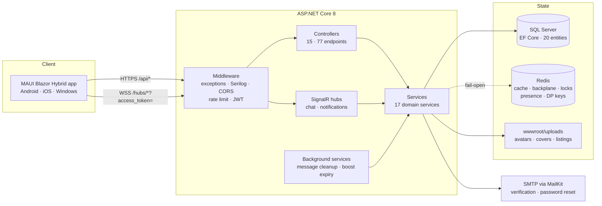

<div align="center">

# Uslužionica API

**Backend for a Serbian services marketplace — where clients find providers, agree on the job, and pay part of it in platform tokens.**

[](https://github.com/djuk1ca/UsluzionicaServer/actions/workflows/ci.yml)
[](https://github.com/djuk1ca/UsluzionicaServer/actions/workflows/codeql.yml)
[](docs/testing.md)
[](https://dotnet.microsoft.com/)
[](docs/deployment.md)

[Architecture](docs/architecture.md) · [API reference](docs/api-reference.md) · [Search engine](docs/search.md) · [Token economy](docs/token-economy.md) · [Deployment](docs/deployment.md) · [ADRs](docs/adr/)

</div>

---

## What this is

ASP.NET Core Web API powering **Uslužionica** — a marketplace where people offer and book local services (hairdressers, plumbers, tutors, movers). It handles the full lifecycle: discovery and search, real-time chat, booking negotiation, reviews, and a token economy that lets clients bargain and providers buy visibility.

The mobile client is a separate .NET MAUI Blazor Hybrid app; this repository is the server it talks to.

| | |
|---|---|
| **77 REST endpoints** | across 15 controllers, JWT-secured, role-aware |
| **2 SignalR hubs** | encrypted chat and push notifications over WebSockets |
| **20 EF Core entities** | 10 migrations, SQL Server, 188 seeded service categories |
| **4-tier search** | diacritic-, script- and typo-tolerant Serbian text search |
| **207 tests** | 82.5% line coverage, gated in CI, real SQL Server via Testcontainers |
| **2 deploy targets** | Hetzner (production) and Azure App Service, both fully automated |

---

## Why it is interesting

Most CRUD backends stop at "it returns JSON." A few problems here needed real solutions.

**Serbian text search that actually works.** A user typing `sisanje` must find `Šišanje`, `фризер` must find `Frizerski salon`, and `vodoinstalter` must find `vodoinstalater`. The search runs in four tiers, cheapest first, and stops as soon as a tier returns enough results — so the common query never pays for fuzzy matching. → [docs/search.md](docs/search.md)

**Redis that is never a hard dependency.** Cache, SignalR backplane, distributed locks, presence tracking and Data Protection keys all live in Redis. Every one of them fails open: killing Redis makes the app *slower*, not *broken*. → [docs/scaling.md](docs/scaling.md)

**A token economy with real anti-abuse rules.** Referral rewards pay in two instalments, each triggered by an event that costs something to fake. Service rewards unlock three days after a booking is accepted, so providers cannot farm tokens by confirming and completing instantly. Concurrent token spends are covered by a test that relies on actual database row locks. → [docs/token-economy.md](docs/token-economy.md)

**A CI pipeline that is a gate, not a decoration.** Warnings are errors, style and analyzers are verified, unit and integration suites run separately, coverage reports are merged across both and the build fails below threshold, and the Docker image is built to prove the container still works. → [docs/testing.md](docs/testing.md)

---

## Architecture



Request → middleware pipeline → thin controller → domain service → EF Core. Services are `sealed`, injected through primary constructors, and take `AppDbContext` directly — there is no repository layer, because `DbSet<T>` already is one. That choice has a real consequence for how tests are written, and it is spelled out in [docs/testing.md](docs/testing.md).

Full walkthrough: **[docs/architecture.md](docs/architecture.md)**

---

## Tech stack

| Layer | Choice |
|---|---|
| Runtime | .NET 8, ASP.NET Core Web API |
| Data | EF Core 8, SQL Server 2022 |
| Identity | ASP.NET Identity, JWT bearer (60 min access / 30 day refresh) |
| Real-time | SignalR + Redis backplane |
| Cache & coordination | Redis 7 (StackExchange.Redis) |
| Logging | Serilog — structured, console sink, request logging |
| Validation | FluentValidation + DataAnnotations |
| Mail | MailKit (SMTP) |
| API docs | Swashbuckle / OpenAPI, DocFX site |
| Tests | xUnit, FluentAssertions, Testcontainers, Respawn, NSubstitute |
| Container | Multi-stage Dockerfile, Docker Compose (dev + prod override) |
| CI/CD | GitHub Actions — CI, CodeQL, CD to Hetzner and Azure |

---

## Quick start

### Option A — Docker Compose (nothing but Docker required)

```bash
git clone https://github.com/djuk1ca/UsluzionicaServer.git
cd UsluzionicaServer
cp .env.example .env
```

Fill in `.env`; every value is explained inline in the file. Generate the two keys with PowerShell:

```powershell
[Convert]::ToBase64String((1..64 | % { Get-Random -Max 256 }))
```

```powershell
[Convert]::ToBase64String((1..32 | % { Get-Random -Max 256 }))
```

The first is `JWT_SECRET` (at least 32 bytes). The second is `ENCRYPTION_KEY`, which must decode to **exactly** 32 bytes for AES-256 — the app refuses to start otherwise.

Then bring the stack up:

```bash
docker compose up -d
```

First boot applies 10 migrations and seeds 188 categories, which takes 60–90 seconds; the healthcheck's `start_period` accounts for that.

```bash
curl http://localhost:8080/health
```

The API listens on `http://localhost:8080` and serves Swagger UI at `/swagger`.

### Option B — Local .NET

Requires the .NET 8 SDK and a reachable SQL Server.

```bash
cp appsettings.Local.json.example appsettings.Local.json
```

Fill in the secrets, then:

```bash
dotnet run
```

`appsettings.Local.json` is gitignored. `SecretsGuard` validates every required secret at startup and fails with a message naming exactly what is missing, instead of letting the server start and break on the first login.

### Running the tests

```bash
dotnet test UsluzionicaServer.sln
```

```bash
dotnet test tests/UsluzionicaServer.UnitTests/UsluzionicaServer.UnitTests.csproj
```

The first command runs everything; the second runs only the fast unit suite, which needs no Docker. Integration tests start a real SQL Server through Testcontainers, so Docker must be running for them. See [tests/README.md](tests/README.md).

---

## Repository map

```
├── Controllers/        15 thin HTTP controllers → 77 endpoints
├── Services/           17 domain services — all business rules live here
├── Domain/
│   ├── Entities/       20 EF Core entities
│   └── Enums/          8 domain enums
├── DTOs/               request/response contracts, grouped by module
├── Hubs/               ChatHub, NotificationHub
├── Infrastructure/
│   ├── Search/         normalizer, fuzzy matching, tiered query builder, backfill
│   ├── Redis/          connection, cache, pub/sub invalidation, distributed lock
│   ├── Media/          relative-path storage, absolute-URL serialization
│   ├── MessageEncryption.cs      AES-256-CBC at rest
│   ├── OnlineTracker.cs          presence, Redis-backed with in-memory fallback
│   ├── MessageCleanupService.cs  nightly retention job
│   ├── BoostExpiryService.cs     hourly boost expiry job
│   └── SecretsGuard.cs           startup validation of required secrets
├── Middleware/         global exception handling
├── Persistence/        AppDbContext — schema, indexes, delete behaviour
├── Migrations/         10 EF Core migrations
├── tests/              unit + integration suites
├── docs/               this documentation
└── .github/workflows/  ci · codeql · cd-hetzner · cd-azure
```

---

## Documentation

| Document | What it covers |
|---|---|
| [Architecture](docs/architecture.md) | Layers, request lifecycle, startup sequence, why there is no repository layer |
| [Domain model](docs/domain-model.md) | Entities, relationships, ER diagram, key constraints and indexes |
| [API reference](docs/api-reference.md) | All 77 endpoints with auth requirements and rate limits |
| [Search engine](docs/search.md) | Four-tier search, folding, transliteration, fuzzy matching, index maintenance |
| [Token economy](docs/token-economy.md) | Earning, spending, boosting, referrals, and the anti-abuse rules |
| [Real-time](docs/realtime.md) | SignalR hubs, JWT over WebSockets, groups, presence, message encryption |
| [Security](docs/security.md) | Auth flow, token lifetimes, rate limiting, secrets handling, CodeQL |
| [Scaling & caching](docs/scaling.md) | Redis as an accelerator that never becomes a dependency |
| [Deployment](docs/deployment.md) | Docker image, Compose stacks, Hetzner and Azure pipelines, rollback |
| [Testing](docs/testing.md) | Test strategy, why business rules are integration-tested, the coverage gate |
| [Decisions (ADR)](docs/adr/) | Eight decisions that shaped the codebase, with the reasoning behind each |

---

## Project status

Feature-complete backend for the pre-launch client. Production runs as a Docker Compose stack behind a reverse proxy on Hetzner; the Azure App Service pipeline exists alongside it and is kept working.

## License

Copyright © 2026 Đukić. All rights reserved. Source-available for review; not licensed for reuse or redistribution.
