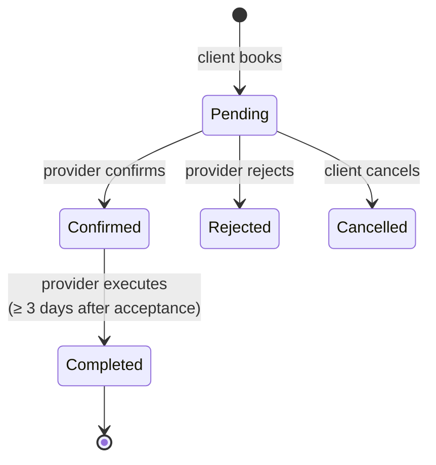

# API reference

77 endpoints across 15 controllers. Swagger UI is served at `/swagger` in Development, with the OpenAPI document at `/swagger/v1/swagger.json`.

---

## Conventions

### Response envelope

Every response uses the same shape:

```json
{ "success": true, "data": { } }
```

```json
{ "success": false, "message": "Nedovoljno tokena. Vaš balans: 1,5, potrebno: 3." }
```

This holds for validation failures too. `[ApiController]` would normally return RFC 7807 `ValidationProblemDetails`, which is a different shape and led to the client rendering strings like `NewPassword: Lozinka mora imati…`. `InvalidModelStateResponseFactory` is overridden to return the first validation message inside the standard envelope.

Error messages are in Serbian — they are written to be shown to the user as-is.

### Paged responses

Any endpoint taking `page` and `pageSize` returns:

```json
{
  "items": [],
  "total": 137,
  "page": 1,
  "pageSize": 20,
  "pages": 7
}
```

`pageSize` defaults to 20 and is clamped server-side — 50 for listing search, 100 for admin lists.

### Authentication

```
Authorization: Bearer <access token>
```

SignalR hubs take the same token as `?access_token=` on the query string, because a WebSocket handshake cannot send headers. See [realtime.md](realtime.md).

| Marker | Meaning |
|---|---|
| **public** | no token required |
| **auth** | any authenticated, active account |
| **Admin** | `Admin` role required |

Every authenticated request additionally verifies that the account is still active — a deactivated or deleted account stops working immediately rather than at token expiry. See [security.md](security.md).

### Enums

Serialized as strings, never as integers: `"Pending"`, not `0`.

### Media URLs

Image fields are stored relative and expanded to absolute URLs on serialization, using `App:BaseUrl`. Clients always receive a fully qualified URL.

---

## Auth — `/api/auth`

| Method | Path | Access | Rate limit |
|---|---|---|---|
| POST | `/api/auth/register` | public | email |
| POST | `/api/auth/login` | public | auth |
| GET | `/api/auth/verify-email` | public | |
| POST | `/api/auth/refresh` | public | |
| POST | `/api/auth/logout` | public | |
| POST | `/api/auth/resend-verification` | public | email |
| POST | `/api/auth/forgot-password` | public | email |
| POST | `/api/auth/reset-password` | public | auth |

Registration accepts an optional `referralCode`. Login is refused until the email is confirmed. Password reset uses a six-digit code delivered by email and stored hashed. Rate limits: `auth` is 5 requests per minute per IP, `email` is 3 per 15 minutes per IP.

## Users — `/api/users`

| Method | Path | Access | Rate limit |
|---|---|---|---|
| GET | `/api/users/me` | auth | |
| PUT | `/api/users/me` | auth | |
| DELETE | `/api/users/me` | auth | auth |
| POST | `/api/users/me/avatar` | auth | |
| GET | `/api/users/{id}` | public | |

`DELETE /me` deactivates rather than deleting rows — the other side of every past booking, review and conversation still references the account. It is rate limited because it is destructive.

## Provider — `/api/provider`

| Method | Path | Access |
|---|---|---|
| POST | `/api/provider/activate` | auth |
| GET | `/api/provider/me` | auth |
| PUT | `/api/provider/me` | auth |
| POST | `/api/provider/me/cover` | auth |
| GET | `/api/provider/{id}` | public |
| GET | `/api/provider/{id}/listings` | public |

Activation requires a confirmed email, and it is what triggers the second referral instalment for whoever invited this user. Public profiles are cached for 5 minutes.

## Categories — `/api/categories`

| Method | Path | Access |
|---|---|---|
| GET | `/api/categories` | public |
| POST | `/api/categories` | Admin |
| PUT | `/api/categories/{id}` | Admin |
| DELETE | `/api/categories/{id}` | Admin |

`GET` returns the full tree (188 seeded categories), cached in Redis with a 6-hour TTL and explicitly invalidated on every write. Each write also publishes a pub/sub message so all instances drop their in-memory folded-name index.

## Listings — `/api/listings`

| Method | Path | Access |
|---|---|---|
| GET | `/api/listings` | public |
| GET | `/api/listings/{id}` | public |
| GET | `/api/listings/my` | auth |
| POST | `/api/listings` | auth |
| PUT | `/api/listings/{id}` | auth |
| PATCH | `/api/listings/{id}/status` | auth |
| DELETE | `/api/listings/{id}` | auth |
| POST | `/api/listings/{id}/images` | auth |
| DELETE | `/api/listings/{id}/images/{imageId}` | auth |
| POST | `/api/listings/{id}/boost` | auth |

`GET /api/listings` is the search endpoint:

| Parameter | Type | Notes |
|---|---|---|
| `q` | string | free text — diacritic-, script- and typo-tolerant |
| `categorySlug` | string | a parent slug also matches its children |
| `city` | string | Serbian municipality; folded prefix match, so `beograd` covers `Beograd — Vračar` |
| `page` | int | default 1 |
| `pageSize` | int | default 20, max 50 |

The full four-tier algorithm is documented in [search.md](search.md). Results are always ordered boosted-first; there is no parameter to request only boosted listings.

`POST /{id}/boost` takes `tokensToSpend` and `durationDays` (3, 7 or 14). Token deduction is atomic — see [token-economy.md](token-economy.md).

## Bookings — `/api/bookings`

| Method | Path | Access |
|---|---|---|
| POST | `/api/bookings` | auth |
| GET | `/api/bookings/incoming` | auth |
| GET | `/api/bookings/outgoing` | auth |
| PATCH | `/api/bookings/{id}/confirm` | auth |
| PATCH | `/api/bookings/{id}/reject` | auth |
| PATCH | `/api/bookings/{id}/cancel` | auth |
| POST | `/api/bookings/{id}/execute` | auth |



`incoming` is the provider's view, `outgoing` the client's. `execute` is refused until three days after `AcceptedAt`, and is idempotent afterwards. It pays the client a service reward token.

## Reviews

| Method | Path | Access |
|---|---|---|
| POST | `/api/reviews` | auth |
| GET | `/api/listings/{id}/reviews` | public |
| GET | `/api/provider/{id}/reviews` | public |
| GET | `/api/provider/{id}/reviews/summary` | public |

One review per author per listing, enforced by a unique index. You cannot review your own listing. If `bookingRequestId` is supplied it must be a completed booking belonging to the author. Every new review recalculates the provider's `AverageRating` and `TotalReviews`.

## Conversations — `/api/conversations`

| Method | Path | Access |
|---|---|---|
| GET | `/api/conversations` | auth |
| POST | `/api/conversations` | auth |
| GET | `/api/conversations/{id}/messages` | auth |
| POST | `/api/conversations/{id}/messages` | auth |
| PATCH | `/api/conversations/{id}/read` | auth |

The REST message endpoints exist alongside `ChatHub` so a client with a dropped WebSocket can still send and read. Message bodies are stored encrypted and returned as plaintext. History older than `MessageRetentionDays` (14) is deleted nightly.

## Discount offers — `/api/discount-offers`

| Method | Path | Access |
|---|---|---|
| POST | `/api/discount-offers` | auth |
| GET | `/api/discount-offers/incoming` | auth |
| GET | `/api/discount-offers/outgoing` | auth |
| PATCH | `/api/discount-offers/{id}/accept` | auth |
| PATCH | `/api/discount-offers/{id}/reject` | auth |

The balance check at creation is advisory; the binding, atomic check happens on accept, since the balance can change in between.

## Tokens — `/api/tokens`

| Method | Path | Access |
|---|---|---|
| GET | `/api/tokens/balance` | auth |
| GET | `/api/tokens/transactions` | auth |

The transaction ledger is paged, newest first, and every row carries `balanceAfter`.

## Referrals — `/api/referrals`

| Method | Path | Access |
|---|---|---|
| GET | `/api/referrals/my-code` | auth |
| GET | `/api/referrals/stats` | auth |

Stats break down invitees by status: `Pending`, `Registered` (first instalment paid), `Rewarded` (both paid).

## Favorites — `/api/favorites`

| Method | Path | Access |
|---|---|---|
| POST | `/api/favorites/listings/{id}` | auth |
| POST | `/api/favorites/providers/{id}` | auth |
| GET | `/api/favorites/listings` | auth |
| GET | `/api/favorites/providers` | auth |
| GET | `/api/favorites/listings/{id}/status` | auth |
| GET | `/api/favorites/providers/{id}/status` | auth |

`POST` is a toggle — it adds if absent, removes if present, and returns the resulting `isFavorited`. Unique constraints make concurrent double-taps safe.

## Notifications — `/api/notifications`

| Method | Path | Access |
|---|---|---|
| GET | `/api/notifications` | auth |
| PATCH | `/api/notifications/{id}/read` | auth |
| PATCH | `/api/notifications/read-all` | auth |

Notifications are persisted before being pushed, so an offline recipient receives them on the next `GET`. Twelve `NotificationKind` values, each with an optional `referenceType`/`referenceId` pointer the client uses to deep-link.

## Locations — `/api/locations`

| Method | Path | Access |
|---|---|---|
| GET | `/api/locations/cities` | public |

Serbian municipalities, served from a static in-code list.

## Admin — `/api/admin`

Every endpoint requires the `Admin` role, applied at controller level.

| Method | Path |
|---|---|
| GET | `/api/admin/users` |
| PATCH | `/api/admin/users/{id}/deactivate` |
| POST | `/api/admin/users/{id}/grant-tokens` |
| GET | `/api/admin/listings` |
| PATCH | `/api/admin/listings/{id}/archive` |
| POST | `/api/admin/providers/{id}/verify` |
| GET | `/api/admin/tokens` |
| GET | `/api/admin/stats` |
| GET | `/api/admin/analytics` |

User search runs over the folded `SearchName` column, so `milos` finds `Miloš` and `djordje` finds `Đorđe`; email is matched directly since addresses are ASCII anyway. `analytics` takes a `days` parameter for the time series behind the dashboard charts. Granted tokens appear in the ledger as `AdminGrant`, like any other movement.

---

## Health

| Path | Question it answers | Includes Redis |
|---|---|---|
| `/health` | may I take traffic? | no |
| `/health/full` | is everything healthy? | yes |

Two endpoints, deliberately. With a single one running every check, stopping Redis returned 503 even though categories and search kept working normally — Docker would mark the container unhealthy and a load balancer would pull it from rotation because of a cache. `/health` therefore excludes checks tagged `cache`. `/health/full` returns per-check status, tags and timing as JSON, for monitoring and manual diagnosis.

---

## Rate limits

| Policy | Limit | Applies to |
|---|---|---|
| `auth` | 5 requests / 60 s per IP | login, reset-password, delete account |
| `email` | 3 requests / 900 s per IP | register, resend-verification, forgot-password |

Partitioned by IP so one attacker cannot exhaust the quota for everyone. Rejections return 429 with the standard envelope. Both limits are configuration rather than constants — production can tune them without a rebuild, and the test suite raises them (all test requests share one IP) while one dedicated test class lowers them to prove the limiter works.

---

## Related

- [Security](security.md) — the auth flow behind these endpoints
- [Real-time](realtime.md) — the SignalR surface alongside this one
- [Token economy](token-economy.md) — the rules behind the wallet, boost and offer endpoints
