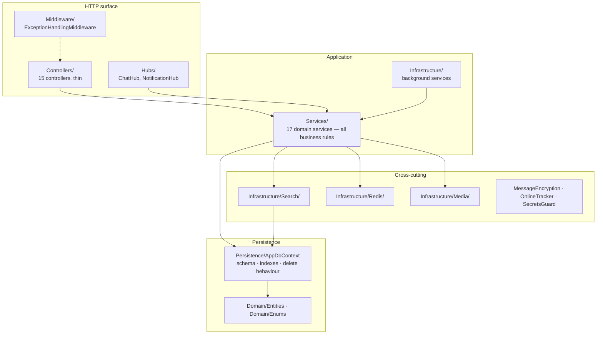
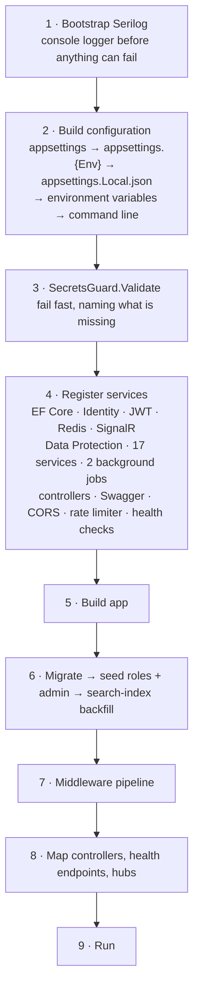
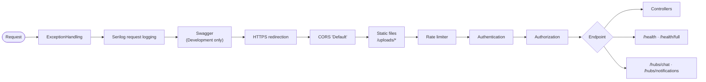
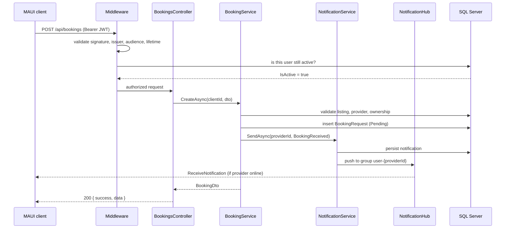

# Architecture

How the server is put together, what happens on startup, and what a request travels through.

---

## Layers

Responsibilities are strict in one direction: **controllers never contain business rules, and services never touch `HttpContext`.**

A controller does four things — read the authenticated user id from claims, bind the DTO, call one service method, and map the result to an HTTP status code. Everything that could be called a rule (who may cancel a booking, when a token reward unlocks, whether a review is allowed) lives in `Services/`. That is why the integration test suite can exercise business rules by calling services directly, without going through HTTP.

## Why there is no repository layer

`DbSet<T>` is already a repository, and `AppDbContext` is already a unit of work. Wrapping them in hand-written `IListingRepository` interfaces would add a layer whose only job is to forward calls, and it would cost real capability: `IQueryable` composition across search tiers, `Include` chains, `ExecuteUpdateAsync`, and projections straight into DTOs.

The trade-off is explicit and is paid for in the test strategy. Services are `sealed` and take `AppDbContext` directly, so they cannot be mocked — which is fine, because mocking a `DbContext` tests a LINQ-to-objects provider rather than a database. Business rules are therefore verified against a real SQL Server started by Testcontainers. See [ADR-0001](adr/0001-no-repository-layer.md) and [testing.md](testing.md).

---

## Startup sequence

`Program.cs` is the single composition root — 567 lines, heavily commented, no `Startup` class and no extension-method indirection. It runs in this order.

### Configuration precedence

The order is deliberate and the code re-adds environment variables on purpose:

| Source | Beats | Purpose |
|---|---|---|
| `appsettings.json` | — | non-secret defaults, secrets left empty |
| `appsettings.{Environment}.json` | base | per-environment overrides |
| `appsettings.Local.json` | both above | developer machine secrets, gitignored |
| Environment variables | everything above | production secrets |
| Command line | everything | ad-hoc overrides |

`AddJsonFile` appends to the end of the provider chain, so adding `appsettings.Local.json` last would have let a stale local file override production environment variables. `AddEnvironmentVariables()` is therefore called again afterwards, restoring env vars to the top of the chain.

### Fail-fast secret validation

`SecretsGuard.Validate` runs before anything else is registered. It requires `ConnectionStrings:DefaultConnection`, `Jwt:Secret`, `Encryption:MessageKey` and `AdminSeed:Password`; in Production it additionally requires the SMTP settings, because without them nobody can confirm an account or reset a password. It also rejects a hard-coded list of previously-leaked placeholder values, so a key that once appeared in the repository can never be used again.

### Startup data work

Three things happen inside a single scope after `builder.Build()`, and the order matters:

1. `db.Database.MigrateAsync()` — applies pending migrations.
2. `SeedRolesAndAdminAsync` — creates the `Admin` and `User` roles and the seeded admin account if absent.
3. `SearchIndexBackfill.RunAsync` — repopulates denormalized search columns for rows indexed under an older ruleset. It must run after migrations (the columns must exist) and after seeding (so the admin user is indexed too). It is idempotent and does nothing on an already-indexed database.

---

## Middleware pipeline

`ExceptionHandlingMiddleware` is registered first so it also catches failures thrown by the middleware below it. Every unhandled exception becomes the same response envelope the rest of the API uses.

**Consistent error shape.** `[ApiController]` normally returns RFC 7807 `ValidationProblemDetails` on a model-binding failure, which is a different shape from the `{ success, message }` envelope everything else returns — the client ended up displaying strings like `NewPassword: Lozinka mora imati…`. `ApiBehaviorOptions.InvalidModelStateResponseFactory` is overridden to return the first validation message in the standard envelope instead.

**Media URLs.** Uploaded files are stored in the database as relative paths (`/uploads/listings/3/abc.jpg`) and expanded to absolute URLs during JSON serialization by `MediaUrlJsonModifier`. Storing absolute URLs would mean every domain change — localhost to production, or later a CDN — breaks every existing image and requires a data migration. SignalR has its own serializer, independent of MVC, so the modifier is registered twice: once on `AddControllers` and once on `AddJsonProtocol`. See [ADR-0006](adr/0006-relative-media-urls.md).

---

## Request lifecycle

A representative authenticated write — a client requesting a booking:

Two details worth calling out.

**Every request re-checks that the account is alive.** A JWT is stateless and valid for 60 minutes. Without a check, a deleted or admin-deactivated account would keep working for the rest of that window — "delete my account" would not really delete anything, and a ban would not really ban. `JwtBearerEvents.OnTokenValidated` therefore performs one primary-key lookup per request to confirm `IsActive`. It is a buffer-cache hit, and the cost is accepted deliberately.

**Notifications are stored first, pushed second.** If the recipient is not connected, the row is already in the database and will be delivered by the next `GET /api/notifications`. The push is an optimisation, never the source of truth.

---

## Service inventory

| Service | Responsibility |
|---|---|
| `AuthService` | register, login, email verification, refresh, logout, password reset |
| `TokenService` | JWT generation, refresh-token generation, referral code generation |
| `UserService` | profile read/update, avatar upload, account deletion |
| `ProviderService` | provider activation, profile, cover image, public profile (cached) |
| `CategoryService` | category tree CRUD, cached with explicit cross-instance invalidation |
| `ListingService` | listing CRUD, image upload, and the four-tier search |
| `BookingService` | booking lifecycle and the three-day execution rule |
| `ReviewService` | reviews plus provider rating recalculation |
| `FavoriteService` | favourite listings and providers, toggle semantics |
| `ConversationService` | conversations, message history, read state |
| `NotificationService` | persist plus real-time push, used by every other service |
| `TokenWalletService` | balance, ledger, discount token offers |
| `BoostService` | spend tokens for listing visibility |
| `ReferralService` | two-instalment referral rewards, idempotent |
| `AdminService` | user and listing moderation, token log, stats, analytics |
| `EmailService` | transactional email via MailKit, behind `IEmailService` |
| `GeoService` | city lookup from IP, 3-second timeout, best-effort |

All are `Scoped` except `MessageEncryption`, `OnlineTracker` and `CategorySearchIndex`, which are singletons.

## Background services

| Service | Schedule | Work |
|---|---|---|
| `MessageCleanupService` | daily at UTC midnight, plus once at startup | deletes messages older than `MessageRetentionDays` (default 14); `Conversation` rows are kept forever so users can still see who they talked to |
| `BoostExpiryService` | hourly, plus once at startup | deactivates expired boosts and subtracts their contribution from `Listing.BoostScore` |

Both are singletons that resolve a fresh scope per run, because `AppDbContext` is scoped and lifetimes must not be mixed. Both take a `DistributedLock` so that exactly one instance performs the work when several are running — without it, two instances would subtract the same boost score twice. See [scaling.md](scaling.md).

---

## Related

- [Domain model](domain-model.md) — the entities these services operate on
- [Security](security.md) — the authentication pipeline in detail
- [Scaling & caching](scaling.md) — what Redis does and what happens without it
- [ADR index](adr/README.md) — the reasoning behind the structural choices above
