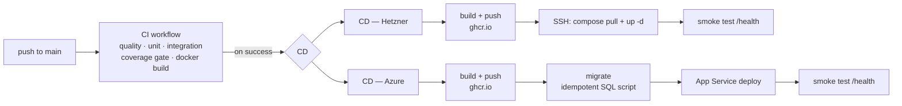
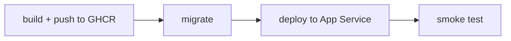

# Deployment

The image is built once by CI, published to GHCR, and deployed unchanged. Two targets are maintained: **Hetzner** (production) and **Azure App Service**.

---

## Pipeline



Both CD workflows trigger on `workflow_run` completion of **CI**, restricted to `main` and to a successful conclusion. Nothing deploys that has not passed every gate. `concurrency` with `cancel-in-progress: false` ensures deploys queue rather than overlap — cancelling a half-finished deploy is worse than waiting for it.

Images are tagged by commit SHA, not `latest`, so the running version is always identifiable and rollback is a matter of naming a previous tag.

---

## The image

Two-stage build, `mcr.microsoft.com/dotnet/sdk:8.0` → `mcr.microsoft.com/dotnet/aspnet:8.0` (~800 MB down to ~220 MB). Nothing crosses over but the publish output.

**Layer caching.** The `.csproj` is copied and restored before the rest of the source, so the restore layer is only invalidated when a package is added or removed, not on every code edit — 30 to 60 seconds saved per build. Restore runs against the `.csproj` rather than the `.sln`, because the solution also references both test projects and would pull in Testcontainers, xUnit and Respawn, none of which belong in the image.

**Not Alpine, not chiseled.** Those variants ship without ICU, and `SearchNormalizer` calls `String.Normalize(FormD)`, which throws `PlatformNotSupportedException` without it. Serbian search would break entirely. The Debian image has full ICU.

**`curl` is installed for one reason.** The Debian .NET runtime image is stripped and has no `curl`, `wget`, `nc` or `python`. A Docker healthcheck calling a missing command does not report a useful error — the container simply sits `unhealthy` forever, and every `depends_on: service_healthy` waiting on it never unblocks. The install step is placed before `COPY --from=build`, so a code change does not invalidate it, and before `USER $APP_UID`, because apt needs root.

**`wwwroot` must exist before startup.** `IWebHostEnvironment.WebRootPath` is `null` if the directory is missing, so the first image upload would throw `ArgumentNullException` on `Path.Combine`. The directories are created empty in the image and `chown`ed, because the app runs non-root and needs write access; content arrives from the volume.

**Non-root.** The .NET 8 images already contain the `app` user (UID 1654), exposed as `$APP_UID`. Without switching to it, compromising the application means root inside the container. That is also why the port is 8080 — a non-root process cannot bind below 1024.

---

## Compose

`docker-compose.yml` is the base and is used locally as-is. `docker-compose.prod.yml` is an **override layer**, not a replacement:

```bash
docker compose -f docker-compose.yml -f docker-compose.prod.yml up -d
```

| Service | Image | Notes |
|---|---|---|
| `db` | `mssql/server:2022-latest` | mapped to host port **14330**, not 1433, so it does not clash with a local SQL Server |
| `cache` | `redis:7-alpine` | AOF persistence enabled |
| `api` | built locally / pulled in prod | depends on both being `service_healthy` |

`depends_on: service_healthy` is required rather than a plain dependency, because `Program.cs` calls `MigrateAsync()` before `app.Run()`. A plain `depends_on` only waits for the container to start, not for the database to accept connections — the app would throw and the container would die.

The api healthcheck has a **90 second `start_period`**, because the first boot applies 10 migrations and seeds 188 categories. Failures inside that window do not count towards `retries`, so a container that is merely still starting is not declared dead.

Uploads use a **named volume, not a bind mount**. A named volume inherits ownership from the `chown`ed directory in the image; a bind mount imposes host ownership and every upload fails with "Permission denied" because the container runs non-root.

### What the production override changes

| Change | Why |
|---|---|
| `build:` → `image: ghcr.io/…:${IMAGE_TAG}` with `build: !reset null` | the server has no source code and should not have any; the exact bytes CI built and tested are what run |
| `ASPNETCORE_ENVIRONMENT: Production` | enables stricter `SecretsGuard` rules and `RequireConfirmedEmail` |
| `App__BaseUrl`, `Cors__AllowedOrigins__0` | real domains — image URLs depend on the first |
| api ports → `127.0.0.1:8080:8080` | the base file's `8080:8080` would expose the API to the whole internet on a public IP, bypassing the reverse proxy and therefore TLS |
| `db` and `cache` ports → `!reset []` | never reachable from outside; the API still reaches them over the Docker network by service name |

---

## Hetzner (production)

Hetzner Cloud is a bare Linux box, so there is no managed deploy action. The image is published to GHCR and the server is told to pull it over SSH.

```bash
cd /opt/usluzionica
echo "IMAGE_TAG=${TAG}" >> .env
docker compose -f docker-compose.yml -f docker-compose.prod.yml pull api
docker compose -f docker-compose.yml -f docker-compose.prod.yml up -d api
docker image prune -f
```

**`script_stop: true`** on the SSH action matters. Without it the commands run in a login shell without `set -e`, so a failed `pull` would pass unnoticed and `up -d` would happily restart the old image while the workflow reported success.

The deployed tag is written into `.env` on the server, so the box always knows exactly which version is running, and rollback is one line plus `up -d`.

Images accumulate after every deploy and eventually fill the disk. `docker image prune -f` without `-a` removes only images no container is using.

### Smoke test

Runs **from the GitHub runner over the public internet**, not from inside the server. That way it verifies DNS, the reverse proxy and TLS as well as the container — 24 attempts, 5 seconds apart, until `/health` returns 200. If it never does, the job fails and prints rollback instructions into the workflow summary.

### Server prerequisites

| Secret | Value |
|---|---|
| `HETZNER_HOST` | IP or hostname |
| `HETZNER_USER` | deploy user — **not root** |
| `HETZNER_SSH_KEY` | full private key including BEGIN/END lines |
| `HETZNER_SSH_PORT` | optional, defaults to 22 |
| `GHCR_TOKEN` | GitHub PAT with `read:packages` — `GITHUB_TOKEN` is not valid off the runner |

Variable: `HETZNER_API_DOMAIN`.

On the box: a `deploy` user in the `docker` group (if the key leaks, the attacker gets Docker, not the whole system); `/opt/usluzionica/` holding both compose files and `.env`; and a reverse proxy — Caddy or nginx — terminating TLS on 443 against the container's HTTP 8080.

---

## Azure App Service

Azure is a managed service, so the shape differs in one important way: **migrations are a separate job that runs before the deploy**, rather than being applied by the starting container.



The migrate job generates an **idempotent** SQL script with `dotnet ef migrations script --idempotent` and applies it with `azure/sql-action`. Idempotent means the script checks the migrations history table itself, so re-running it is safe.

Two details in that job are non-obvious:

**Placeholder secrets are required to generate the script.** `dotnet ef` builds the application in memory to resolve the `DbContext`, which means `SecretsGuard` runs and demands its values. The ones supplied are deliberately fake — the script is generated from the code, never from a database.

**`azure/login` is needed even though the job never touches App Service.** Azure SQL only accepts connections from allow-listed IPs, and a GitHub runner gets a random address every run, so it cannot be pre-registered. `azure/sql-action` adds its own address to the firewall before writing and removes it afterwards — but only within an authenticated session. The alternative is leaving the database open to the entire internet, which is not an option. Authentication uses OIDC (`id-token: write`), so there is no long-lived Azure credential in the repository.

Both CD workflows use a GitHub **Environment** (`production-hetzner`, `production`), which is what makes required reviewers and environment-scoped secrets possible.

---

## Rollback

**Hetzner** — one line on the server:

```bash
cd /opt/usluzionica
sed -i "s/^IMAGE_TAG=.*/IMAGE_TAG=sha-PREVIOUS/" .env
docker compose -f docker-compose.yml -f docker-compose.prod.yml up -d api
```

**Azure** — redeploy the previous image tag, or use the App Service deployment slot history.

Both workflows print these instructions into the run summary automatically when a deploy fails, so nobody has to find this page mid-incident.

Note that rolling the image back does **not** roll the database back. Migrations are forward-only; a schema change that breaks the previous image requires a forward fix, not a rollback.

---

## Configuration reference

Everything is supplied as environment variables in production, using ASP.NET's `__` nesting convention.

| Variable | Purpose |
|---|---|
| `ConnectionStrings__DefaultConnection` | SQL Server |
| `Jwt__Secret` | signing key, min 32 bytes |
| `Jwt__Issuer`, `Jwt__Audience` | token validation |
| `Encryption__MessageKey` | Base64, exactly 32 bytes after decoding |
| `AdminSeed__Email`, `AdminSeed__Password` | seeded admin account |
| `App__BaseUrl` | absolute image URLs depend on this |
| `Cors__AllowedOrigins__0` | explicit origin list |
| `Redis__Connection` | optional — everything degrades gracefully without it |
| `Email__Host`, `__Port`, `__Username`, `__Password`, `__From` | SMTP; required in Production |
| `ASPNETCORE_ENVIRONMENT` | `Production` enables the stricter rules |

`.env.example` documents every value with the constraints that apply. `SecretsGuard` verifies them at startup and refuses to run with a missing or previously-leaked value.

---

## Related

- [Scaling & caching](scaling.md) — what changes when you run more than one instance
- [Security](security.md) — secret handling and container hardening
- [Testing](testing.md) — the CI gates that run before any of this
