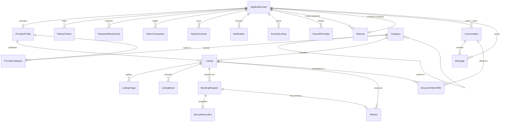

# Domain model

20 entities, mapped with EF Core against SQL Server. Configuration lives in a single place — `Persistence/AppDbContext.cs` — with no attribute-based mapping scattered across the entity classes.

---

## Entity relationships

---

## Entities by module

### Identity and accounts

| Entity | Notes |
|---|---|
| `ApplicationUser` | extends `IdentityUser`. Carries `TokenBalance`, `IsProvider`, `IsActive`, `ReferralCode` (unique, 8 chars) and the denormalized `SearchName` index column |
| `RefreshToken` | one row per issued refresh token, revocable, 30-day lifetime |
| `PasswordResetCode` | six-digit single-use code, **stored SHA-256 hashed**, with expiry and a failed-attempt counter |
| `Referral` | who invited whom, and which of the two reward instalments have been paid |

`PasswordResetCode` exists instead of Identity's built-in `GeneratePasswordResetTokenAsync` because that token is long and unsuited to being typed into a mobile app, while Identity's TOTP provider (which does produce six digits) has a fixed three-minute window — too short if the email sits in a delivery queue. A dedicated table gives full control over expiry, attempt limits and single use.

### Catalogue

| Entity | Notes |
|---|---|
| `Category` | self-referencing tree via `ParentId`, unique `Slug`, 188 rows seeded |
| `ProviderProfile` | one per provider user, holds `AverageRating`, `TotalReviews`, `TotalListings`, `IsVerified` |
| `ProviderCategory` | join table — which categories a provider works in |
| `Listing` | the advertised service; price mode, status, view count, boost state and four denormalized search columns |
| `ListingImage` | gallery images, ordered by `SortOrder` |

`Listing` carries `PriceMode` (`Fixed`, `Range`, `Negotiable`) with `FixedPrice` or the `PriceFrom`/`PriceTo` pair, so the client can render "3.500 RSD", "2.000–4.000 RSD" or "by agreement" from one row.

### Booking and reviews

| Entity | Notes |
|---|---|
| `BookingRequest` | `RequestedDate`/`RequestedTime` as `DateOnly`/`TimeOnly`, plus `AcceptedAt` which starts the three-day execution clock |
| `ServiceExecution` | created when a provider marks the service done; unique per booking, which is what makes the token reward unrepeatable |
| `Review` | 1–5 stars, optional comment, optional link to the booking it came from |

### Token economy

| Entity | Notes |
|---|---|
| `TokenTransaction` | append-only ledger. Every movement records `Kind`, `Amount` and `BalanceAfter` |
| `TokenPurchase` | a purchase of tokens for RSD, with bonus tokens and a status |
| `ListingBoost` | tokens spent for visibility over a fixed duration |
| `DiscountTokenOffer` | a client offering tokens to a provider in exchange for a discount |

`BalanceAfter` is stored on every ledger row deliberately. It makes the wallet history auditable on its own, without replaying the whole ledger to explain any single line to a user.

### Messaging and notifications

| Entity | Notes |
|---|---|
| `Conversation` | exactly one per pair of users, enforced by a unique index on `(User1Id, User2Id)` with normalized ordering |
| `Message` | `Text` is stored **AES-256-CBC encrypted**; deleted after `MessageRetentionDays` |
| `Notification` | typed by `NotificationKind`, with an optional polymorphic `ReferenceType`/`ReferenceId` pointer |

### Favourites

`FavoriteListing` and `FavoriteProvider` are separate tables rather than one polymorphic table, so each can carry a real foreign key and a real unique constraint.

---

## Enums

| Enum | Values |
|---|---|
| `ListingStatus` | `Active`, `Paused`, `Archived` |
| `PriceMode` | `Fixed`, `Range`, `Negotiable` |
| `BookingStatus` | `Pending`, `Confirmed`, `Rejected`, `Completed`, `Cancelled` |
| `DiscountOfferStatus` | `Pending`, `Accepted`, `Rejected`, `Cancelled` |
| `ReferralStatus` | `Pending`, `Registered`, `Rewarded` |
| `TokenKind` | `ServiceReward`, `Purchase`, `BoostSpend`, `DiscountSent`, `DiscountReceived`, `Referral`, `AdminGrant` |
| `TokenPurchaseStatus` | `Pending`, `Completed`, `Failed` |
| `NotificationKind` | 12 values covering messages, bookings, tokens, reviews, boosts, offers and referrals |

Enums are serialized as strings (`JsonStringEnumConverter`), so the API contract does not silently change meaning when a value is inserted into the middle of an enum.

---

## Constraints that encode business rules

Several rules are enforced by the database rather than only by service code, so they hold even under concurrency or a future code path that forgets to check.

| Constraint | Rule it enforces |
|---|---|
| `Referral.ReferredUserId` unique | a user can be referred exactly once, ever |
| `ApplicationUser.ReferralCode` unique | referral codes never collide |
| `Conversation (User1Id, User2Id)` unique | one conversation per pair, no duplicates from a double-tap |
| `Review (ListingId, AuthorId)` unique | one review per person per listing |
| `ServiceExecution.BookingRequestId` unique | a booking can be completed once, so its token reward pays once |
| `ProviderProfile.UserId` unique | one provider profile per account |
| `Category.Slug` unique | slugs are safe to use as public identifiers |
| `FavoriteListing (UserId, ListingId)` unique | toggling twice concurrently cannot create duplicates |

The conversation constraint only works because `User1Id`/`User2Id` are normalized to a consistent order before insert — otherwise `(A,B)` and `(B,A)` would be two different rows describing one conversation.

---

## Indexes

Beyond the primary and foreign keys:

| Index | Purpose |
|---|---|
| `Listing (Status, IsBoosted, BoostScore, CreatedAt)` | the default browse ordering — boosted first, then score, then recency — served entirely from the index |
| `Listing (SearchLocation, Status)` | city filtering becomes an index seek instead of a scan |
| `AspNetUsers (SearchName)` | admin user search over the folded name column |
| `Message (ConversationId, SentAt)` | paging a conversation from newest backwards |
| `TokenTransaction (UserId, CreatedAt)` | the wallet ledger view |
| `PasswordResetCode (UserId, UsedAt)` | finding the one active code for a user |
| `RefreshToken (Token)` | refresh lookup on every token rotation |

The composite listing index replaced an earlier `(Status, IsBoosted)` index. Same prefix, but by carrying `BoostScore` and `CreatedAt` it also covers the sort, so the default listing query needs no separate sort operation.

## Delete behaviour

`OnDelete` is set explicitly on every relationship, never left to convention. The pattern:

- **Cascade** where the child has no meaning without the parent — a listing's images, a conversation's messages, a provider profile when the account goes.
- **Restrict** where deletion would destroy history — a user with token transactions, bookings or reviews cannot simply vanish, because the counterparty's records reference them.

That is also why account deletion is a deactivation (`IsActive = false`) rather than a row delete: the other side of every past booking, review and conversation has a legitimate claim on those records.

---

## Migrations

Ten migrations, applied automatically at startup by `db.Database.MigrateAsync()`.

| Migration | Change |
|---|---|
| `InitialCreate` | full initial schema |
| `AddReferralSystem` | referral codes and the `Referral` table |
| `AddExpandedCategories` | the 188-category seed |
| `AddBookingAcceptedAt` | `AcceptedAt`, enabling the three-day rule |
| `RemoveTokenAwardedFromServiceExecution` | reward tracking moved to the ledger |
| `AddFavorites` | favourite listings and providers |
| `NormalizeMediaUrlsToRelative` | rewrote stored absolute image URLs to relative paths |
| `AddPasswordResetCodes` | the hashed six-digit reset code table |
| `AddSearchIndexColumns` | the denormalized `Search*` columns and their indexes |
| `SplitReferralRewardIntoTwoInstalments` | split the single referral payout in two |

Production migrations are not applied by the running container on Azure; a dedicated CD job generates an idempotent SQL script and applies it before the new image is deployed. See [deployment.md](deployment.md).

---

## Related

- [Token economy](token-economy.md) — how the ledger entities are actually used
- [Search engine](search.md) — what the `Search*` columns are for
- [Architecture](architecture.md) — the services that own these entities
