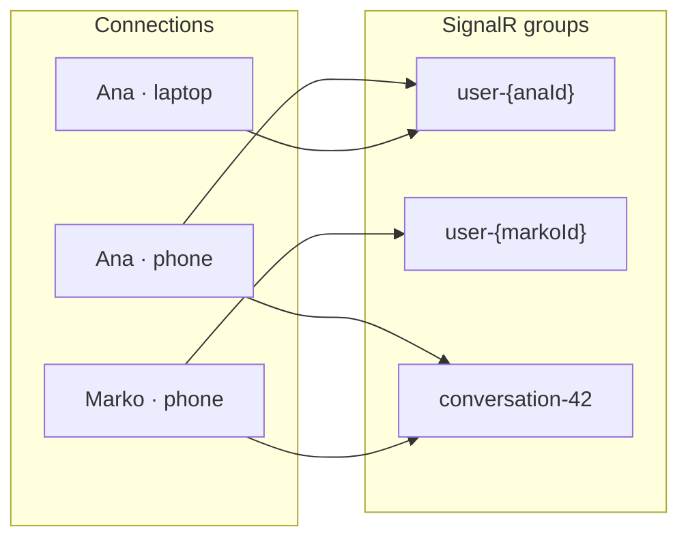
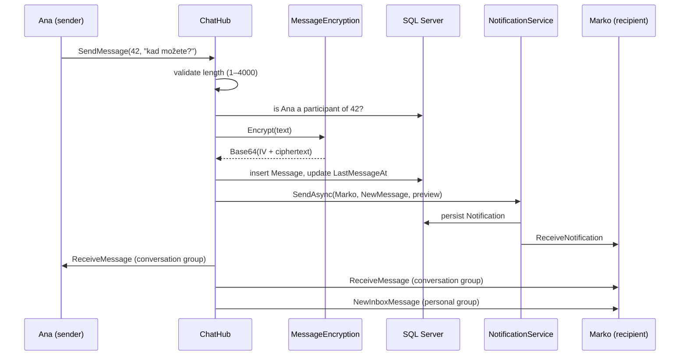

# Real-time

Two SignalR hubs: one for chat, one for notifications. Both authenticate with the same JWT the REST API uses, both work across multiple API instances, and neither is the source of truth for anything.

---

## Hubs

| Hub | Path | Direction |
|---|---|---|
| `ChatHub` | `/hubs/chat` | bidirectional — client invokes methods, server broadcasts |
| `NotificationHub` | `/hubs/notifications` | server → client only |

Both are `[Authorize]`. `NotificationHub` has no client-callable methods at all — it exists purely so the server has a channel to push into.

```
wss://host/hubs/chat?access_token=<JWT>
wss://host/hubs/notifications?access_token=<JWT>
```

### JWT over WebSockets

A WebSocket handshake cannot carry an `Authorization` header, so the client passes the token as a query-string parameter. The `JwtBearerEvents.OnMessageReceived` handler moves it back into place before validation:

```csharp
options.Events = new JwtBearerEvents
{
    OnMessageReceived = context =>
    {
        var token = context.Request.Query["access_token"];
        var path  = context.HttpContext.Request.Path;

        if (!string.IsNullOrEmpty(token) && path.StartsWithSegments("/hubs"))
            context.Token = token;

        return Task.CompletedTask;
    }
};
```

The `StartsWithSegments("/hubs")` guard matters: without it, any REST endpoint would also accept a token in the query string, and tokens would end up in access logs, browser history and referrer headers across the whole API.

CORS must allow credentials for the WebSocket handshake to succeed, which is why the policy calls `AllowCredentials()` and therefore cannot use a wildcard origin. In production the origin list is explicit; in development it is open, for Swagger and local tooling.

---

## Groups



**`user-{userId}`** — joined automatically on connect. This is the server's private channel to a person: notifications, online-status updates, and inbox pings all go here. Every one of that person's devices is in it.

**`conversation-{id}`** — joined explicitly via `JoinConversation`, and only after the hub verifies the caller is actually a participant. Without that check, any authenticated user could join any conversation group by guessing an integer and receive every message in it.

## Events

### Client → server (`ChatHub`)

| Method | Purpose |
|---|---|
| `JoinConversation(int conversationId)` | enter a conversation room after membership validation |
| `SendMessage(int conversationId, string text)` | send a message, 1–4000 characters |
| `UserTyping(int conversationId)` | typing signal; the client re-sends about every 2 seconds |

### Server → client

| Event | Hub | Payload |
|---|---|---|
| `ReceiveMessage` | chat | `MessageDto` — broadcast to the conversation group |
| `NewInboxMessage` | chat | conversation id, sender, preview — to the recipient's personal group |
| `TypingIndicator` | chat | sender's user id — to others in the conversation |
| `UserOnlineStatus` | chat | user id + boolean — to that person's contacts |
| `Error` | chat | message string — to the caller only |
| `ReceiveNotification` | notifications | `NotificationDto` |

`ReceiveMessage` and `NewInboxMessage` are both sent on every message, deliberately. A recipient may have the hub connected without having joined that particular conversation room — the app is open, but on a different screen. The conversation broadcast updates an open chat; the personal-group ping updates the inbox badge.

---

## Sending a message



The message goes into the database **encrypted**; the DTO broadcast to clients carries the **plaintext**. Clients never see ciphertext, and the server never stores plaintext.

The notification preview is truncated to 60 characters and stored unencrypted, because a push notification has to be readable on a lock screen. That is a deliberate, bounded exposure of the first line of a message, not an oversight.

---

## Message encryption at rest

`Message.Text` is AES-256-CBC encrypted. Each message gets a fresh random IV, which is prepended to the ciphertext, and the whole thing is stored as Base64:

```
Base64( [16-byte IV] + [N-byte ciphertext] )
```

A random IV per message means two identical messages produce two different ciphertexts, so the database gives away nothing through repetition.

This is **encryption at rest, not end-to-end**. It protects message content if someone obtains direct access to the SQL database — a stolen backup, a compromised connection string. The server holds the key and can read every message, which it has to, because it renders previews into notifications and applies the retention policy.

The key comes from `Encryption:MessageKey` and must decode from Base64 to exactly 32 bytes. `SecretsGuard` and the `MessageEncryption` constructor both verify this at startup, so a misconfigured key fails immediately with a clear message rather than at the first message send.

### Retention

`MessageCleanupService` deletes messages older than `MessageRetentionDays` (default 14) nightly at UTC midnight, and once at startup in case the server was down for a while.

Only `Message` rows are deleted. `Conversation` rows are kept forever, so users can still see who they have talked to.

---

## Presence

`OnlineTracker` answers "is this person online right now?" — and the answer has to be the same regardless of which API instance is asked.

**Structure.** A Redis set per user:

```
usluzionica:online:{userId} → { connectionId1, connectionId2, … }
```

A set rather than a flag, because the same person can be signed in on a phone and a laptop simultaneously. They are offline only when no connection remains — which is exactly what `OnDisconnectedAsync` checks before telling their contacts they have gone.

**Why it cannot be in-process.** A SignalR connection lives in one process. With two API instances behind a load balancer, Ana is connected to instance A and Marko to instance B. When Marko opens his conversation list, instance B handles the request — and its memory contains nothing about Ana's connection, so it reports her offline. Always.

**TTL.** The key carries a TTL, refreshed on every registration, to protect against a process that dies. `OnDisconnectedAsync` never runs in that case, and the connection id would otherwise stay in the set forever, leaving a ghost user permanently "online".

**Fallback.** Without Redis, `OnlineTracker` uses a `ConcurrentDictionary` in process memory. That is correct behaviour for a single instance and it keeps the integration tests green without requiring Redis in CI.

---

## Running more than one instance

Two things break the moment a second instance exists, and both are handled.

**The backplane.** `Clients.User(...)` only reaches connections held by the current process. Instance A trying to deliver to Marko, who is connected to instance B, finds nobody — and the message vanishes silently: no error, no log, it just never arrives. `AddStackExchangeRedis` routes every send through Redis pub/sub so all instances receive it and whichever one actually holds the connection delivers it. Without it, `docker compose up --scale api=2` breaks chat.

**Data Protection keys.** ASP.NET signs and encrypts email-confirmation and password-reset tokens with keys that default to a folder inside the process. That produces two quiet failures: a container restart generates new keys and invalidates every verification link already sent, and two instances each hold their own keys so a link generated by A cannot be read by B — email confirmation then works roughly half the time, at random. Keys are persisted to Redis with `SetApplicationName("Usluzionica")`, which must be identical across instances.

Both are conditional on `Redis:Connection` being configured, so single-instance local development runs without Redis at all. See [scaling.md](scaling.md).

---

## REST or SignalR?

| Use | Why |
|---|---|
| REST for history, hub for live | Paging a conversation is a request/response problem. The hub is for what arrives while you are looking at the screen. |
| Persist first, push second | The database write is the source of truth. If the recipient is offline the push is simply lost, and the next `GET` delivers it. |
| Hub methods stay thin | `SendMessage` validates, encrypts, saves and broadcasts. Everything reusable lives in a service the REST layer calls too. |

`POST /api/conversations/{id}/messages` exists alongside `ChatHub.SendMessage` for exactly this reason: a client with a dropped WebSocket can still send.

---

## Related

- [Security](security.md) — the JWT pipeline these hubs share
- [Scaling & caching](scaling.md) — the backplane, presence and Data Protection keys
- [Architecture](architecture.md) — where the hubs sit in the pipeline
