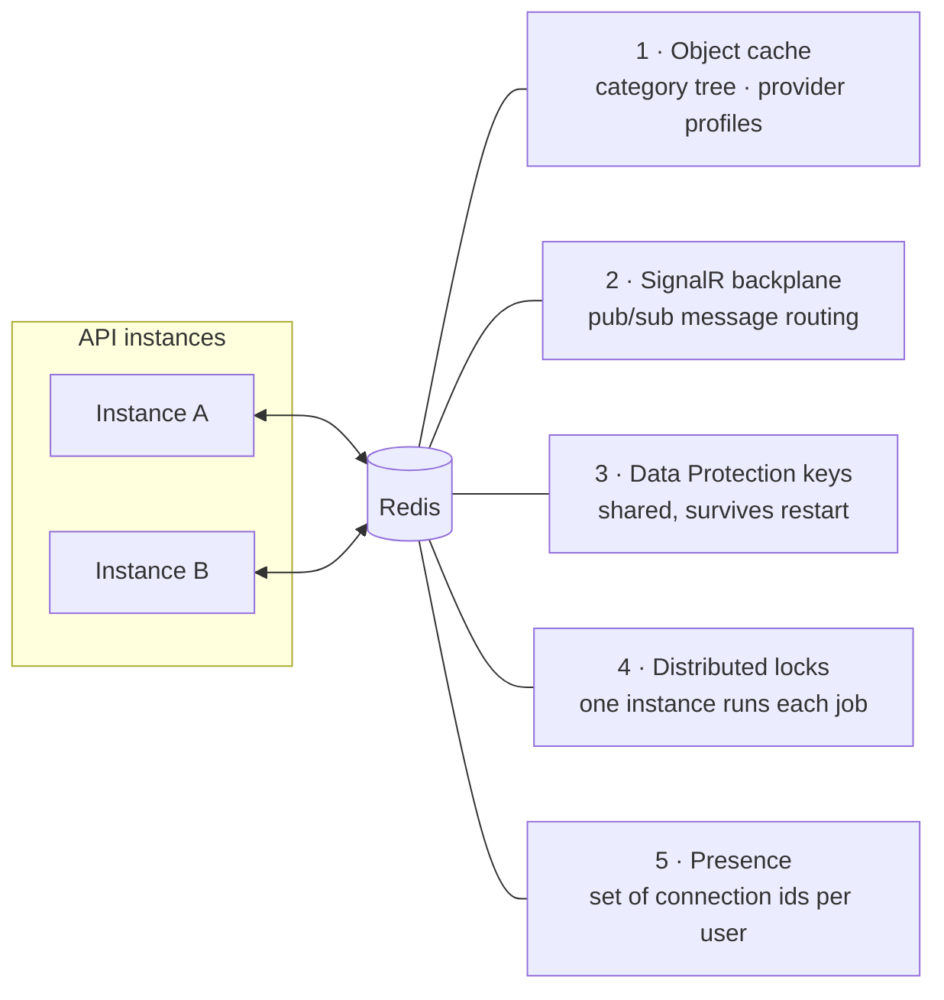

# Scaling & caching

Redis does five separate jobs here. The rule that governs all of them:

> **Redis is an accelerator and a place for shared state. It is never a condition for the application to run.**

The app must start and serve traffic when Redis is not configured at all (local development, integration tests) and when it is configured but dead (an outage in production). No user request may fail because of a cache.

---

## What Redis is used for



| Use | Without Redis |
|---|---|
| Object cache | every read goes to SQL Server — slower, still correct |
| SignalR backplane | correct on one instance; **chat breaks across two** |
| Data Protection keys | verification links die on restart; **random failures across two instances** |
| Distributed locks | fine on one instance; **duplicate work across two** |
| Presence | in-memory fallback, correct on one instance; **always wrong across two** |

The pattern is consistent: with a single instance everything degrades gracefully. The moment there are two, three of these five stop being optional. That is the real dividing line, not "with Redis" versus "without".

---

## Fail-open, concretely

**`AbortOnConnectFail = false`** is the single most important line. Without it, `ConnectAsync` throws when Redis is not reachable at startup and the whole process dies. With it, StackExchange.Redis returns a multiplexer that is "currently disconnected" and reconnects in the background as soon as Redis comes back.

**`RedisConnection.IsAvailable`** lets every caller ask whether Redis exists at all, instead of scattering try/catch through the codebase.

**`CacheService` swallows everything.** The entire point of the class is that callers never write try/catch around a cache:

- read while Redis is down → return `null` → the caller queries the database
- write while Redis is down → silently do nothing → the next request queries the database again

The multiplexer is a singleton. `ConnectionMultiplexer` is thread-safe and multiplexes every command over one TCP connection, and it is expensive to create. Opening a connection per request is the classic mistake that takes Redis down faster than any amount of load.

Keys are namespaced `usluzionica:*`. Redis instances get shared between projects in practice, and without a prefix `categories:tree` from two applications is the same key — one would read the other's data. It also makes `SCAN usluzionica:*` useful when debugging.

---

## 1 · Object cache

| Cached | TTL | Why that TTL |
|---|---|---|
| Category tree | 6 hours | categories change very rarely and only through admin actions, and invalidation is explicit on every write — the TTL is a safety net against a forgotten invalidation, not the primary mechanism |
| Public provider profile | 5 minutes | public and read on every listing view, but changes more often than categories: a new review moves `AverageRating`, a new listing moves `TotalListings`. Short and harmless staleness |

`IDistributedCache` was not used. Its interface deals in byte arrays and has no notion of the get-or-compute pattern, so the same try/catch and serialization logic would be repeated at every call site.

## 2 · Cross-instance invalidation

Some cached state lives in Redis and only needs deleting once. But `CategorySearchIndex` holds the 188 folded category names **in the memory of every process** — deliberately, because it is consulted for every token of every search and a network round trip per token is not acceptable.

So when an admin renames a category, the instance that handled the request clears *its own* copy. Any other instance knows nothing and keeps searching against the old name until its 10-minute TTL expires.

`CacheInvalidator` fixes that with pub/sub: the instance that made the change publishes to a channel, and every instance — including itself — receives it and clears its copy immediately.

If Redis is unavailable the message is never published and each instance falls back on its TTL. Staleness is then bounded at ten minutes instead of milliseconds — slower to converge, but never permanently wrong.

## 3 · Data Protection keys

ASP.NET uses these keys to sign and encrypt anything that leaves the server and comes back — here, primarily Identity's email-confirmation and password-reset tokens.

The default is a folder local to the process, which produces two failures that are hard to diagnose because neither logs an error:

1. **Restart.** The container starts with an empty folder, generates new keys, and every verification link sent before the restart becomes invalid. The user clicks a link from their inbox and is told it expired, when it did not.
2. **Two instances.** Each holds its own keys. A link generated on instance A cannot be read on instance B, so email confirmation works roughly half the time, at random.

Keys are persisted to Redis under `usluzionica:dataprotection-keys` with `SetApplicationName("Usluzionica")`. The application name must be identical everywhere — it defaults to something environment-derived that can differ between containers, and a different name means the keys do not apply.

## 4 · Distributed locks

`BackgroundService` runs in every process. With two instances, `BoostExpiryService` starts subtracting `BoostScore` from the same listings at the same moment on both — every listing decremented twice. `MessageCleanupService` would delete twice (harmless) but also log twice and load the database twice.

The mechanism is `SET key value NX PX ttl`:

- `NX` — write only if the key does not exist, atomically, on the Redis side
- `PX` — expire automatically after the TTL

**The TTL is what makes this safe.** If the instance holding the lock crashes or loses power, the lock releases itself. Without a TTL, one crash would stop that job across the entire cluster forever.

Which means the TTL has to be **longer than the longest expected run**. If the job outlives its lock, another instance picks it up while the first is still working — and we are back to the problem the lock was solving.

## 5 · Presence

Covered in [realtime.md](realtime.md#presence). A Redis set of connection ids per user, TTL-protected against dead processes, with a `ConcurrentDictionary` fallback that is correct for a single instance.

---

## Running multiple instances

```bash
docker compose up -d --scale api=2
```

For this to actually work, all of the following must be true — and they are:

| Requirement | Provided by |
|---|---|
| SignalR messages reach connections on other instances | Redis backplane |
| Presence is consistent across instances | `OnlineTracker` on Redis |
| Data Protection keys are shared | Redis + fixed application name |
| Background jobs run once, not once per instance | `DistributedLock` |
| In-memory caches converge after a write | `CacheInvalidator` pub/sub |
| Uploaded files are visible to every instance | shared `uploads` volume |
| No session affinity required | JWT is stateless; no server-side session |

Sticky sessions are not needed. Every instance can serve any request, and any instance can deliver a SignalR message to a connection held by another.

### What is not solved

**Uploads are on a shared Docker volume, not object storage.** That works for instances on one host and stops working the moment they are on different machines. `MediaUrls` already stores paths relative precisely so that moving to S3 or a CDN later is a configuration change rather than a data migration.

**SQL Server is a single instance.** No read replicas, no sharding. Well within what this workload needs, and worth naming rather than implying otherwise.

---

## Health checks and the cache

Two health endpoints exist because they answer two different questions, and conflating them caused a real incident during testing.

With one endpoint running every check, stopping Redis returned 503 — even though `/api/categories`, search and everything else kept working normally. Docker marked the container unhealthy and a load balancer would have pulled it from rotation. Because of a cache.

| Endpoint | Question | Includes Redis |
|---|---|---|
| `/health` | may I take traffic? | no — checks tagged `cache` are filtered out |
| `/health/full` | is everything healthy? | yes, with per-check status, tags and timing |

Tagging a check `cache` does nothing on its own; the endpoint needs a predicate that actually filters on the tag. That is the part that was missing:

```csharp
app.MapHealthChecks("/health", new HealthCheckOptions
{
    Predicate = check => !check.Tags.Contains("cache")
});
```

The Redis check is also only registered when Redis is configured. Registering it unconditionally would make local development without Redis return 503 and mark a perfectly healthy container as sick.

---

## Related

- [Real-time](realtime.md) — the backplane and presence in context
- [Search engine](search.md) — the in-memory category index this keeps consistent
- [Deployment](deployment.md) — how Redis is wired in Compose
- [ADR-0005](adr/0005-redis-fail-open.md) — the decision behind the fail-open rule
