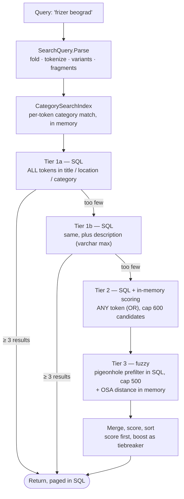

# Search engine

Serbian is a hard language to search naively. It is written in two alphabets, carries five diacritics that people routinely omit, and has long compound words where a single typo is normal. A user typing `sisanje` expects to find `Šišanje`; `фризер` should find `Frizerski salon`; `vodoinstalter` should find `vodoinstalater`.

The search here is built in four tiers, from cheapest to most expensive, and it stops at the first tier that returns enough results. The common query never pays for fuzzy matching.

---

## The pipeline

Tier 1a serves roughly 90% of real queries with a single indexed SQL statement. Tier 1b is separated from it precisely because `Description` is `varchar(max)` and `LIKE '%x%'` over it is the one genuinely expensive operation in the design — so it only runs when the narrower tier came up short.

Tiers 2 and 3 **keep** whatever tier 1b found and merge it with the wider candidate set. Discarding the few exact hits already in hand to replace them with fuzzy ones would make results worse, not better.

`MinAcceptableResults` is 3. Candidate caps are 600 for the OR tier and 500 for the fuzzy tier, because both score in memory.

---

## Folding — one form for both sides

`SearchNormalizer.Fold` reduces any text to lowercase ASCII with no diacritics and Cyrillic transliterated to Latin. The **same** function runs on the way into the database and on the query, which is what guarantees the two sides can never drift apart.

| Input | Folded |
|---|---|
| `Šišanje` | `sisanje` |
| `Đorđe` | `djordje` |
| `фризер` | `frizer` |
| `Beograd — Vračar` | `beograd vracar` |
| `Café` | `cafe` |

Four steps, each there for a specific reason:

1. **NFD decomposition** splits composed characters into a base letter plus a combining mark. This handles `č ć š ž` without touching the map, and gives foreign characters (`é → e`, `ü → u`, `ā → a`) for free.
2. **An explicit character map** handles what NFD cannot. This is not redundant work — verified: `đ` (U+0111) and `Đ` (U+0110) are *not* composed characters, so NFD leaves them alone, and the whole Cyrillic block is likewise untouched. Without the map, every one of those characters would fall through the whitelist and silently disappear from the text. The map also covers digraph transliterations where one character becomes two: `đ → dj`, `љ → lj`, `њ → nj`, `џ → dz`.
3. **Combining marks are dropped** — what NFD separated in step 1.
4. **`ToLowerInvariant`, never `ToLower()`.** Under the `tr-TR` culture, `I` lowercases to a dotless `ı`, which would fold Turkish-locale text differently from everything else in the database.

### Why the columns are denormalized

Four columns on `Listing` hold the folded copies:

| Column | Source | Role |
|---|---|---|
| `SearchTitle` | `Title` | high signal, indexed |
| `SearchLocation` | `Location` | separate so city filtering is an index seek |
| `SearchBody` | `Description` | low signal, `varchar(max)`, searched only in tier 1b |
| `SearchVersion` | — | which ruleset version indexed this row |

The alternative — relying on the database's accent-insensitive collation — was rejected. Collation cannot transliterate Cyrillic to Latin at all, it does not handle `đ → dj`, and it makes matching behaviour a property of the database server rather than of the code, invisible in the repository and different between a developer machine and production.

`ApplicationUser.SearchName` exists for the same reason, so admin user search finds `Miloš` when someone types `milos`.

### The columns maintain themselves

`SearchIndexer.Apply` is called from `AppDbContext.SaveChanges`, **not** from the services. If index maintenance lived in `ListingService.CreateAsync` and `UpdateAsync`, then every future write path — an admin edit, a seed, a manual data fix — would be one forgotten line away from silently breaking search. A listing would exist in the database and be unfindable, with nothing to indicate why.

Routing it through the change tracker makes it impossible to bypass: anything that gets saved gets a fresh index.

### `SearchVersion` and backfill

When the folding rules change — a new letter, a different mapping — every already-indexed row becomes stale. `SearchNormalizer.Version` is bumped, and `SearchIndexBackfill` re-indexes every row whose `SearchVersion` does not match on the next startup.

This cannot be an EF migration, because SQL Server cannot execute a C# function. Writing `Fold()` as T-SQL would mean a chain of roughly forty nested `REPLACE` calls, collation-dependent, with no NFD support, and the folding logic would live in two places that quietly diverge.

The backfill processes 500 rows per batch. The small batch size is not about throughput — it is to avoid locking a large number of rows in one transaction, which on a production database would block users for the duration.

---

## Tiers 1a and 1b — all tokens must match

Every token must be found, in the title, the location, or a matching category. Successive `.Where()` calls give AND across tokens, which is exactly right: for `frizer beograd`, the listing must satisfy both conditions.

Category matching is **per token, not a union**. For that query, `frizer` matches a category and `beograd` does not, so the listing still has to satisfy the city condition separately. Returning the union would have returned every listing in the hairdressing category regardless of city.

City filtering deserves a note. It used to be `l.Location == city`, an exact comparison — so `cacak` did not find `Čačak`, and `beograd` did not find `Beograd — Vračar`. It is now a prefix `LIKE` over the folded column, which keeps Belgrade's municipalities inside the city.

### Category names are not denormalized into the listing

`CategorySearchIndex` keeps the 188 folded category names in memory instead. A category is shared by many listings, so denormalizing its name into `SearchTitle` would mean an admin renaming one category makes every listing in it stale — and renaming does not go through the listings, so the index would quietly stay wrong.

It is a singleton with a 10-minute TTL, per process, deliberately: it is consulted for every token of every search, so a network round trip per token is out of the question. Cross-instance staleness is solved by `CacheInvalidator` publishing over Redis pub/sub so all instances clear their copy at once; the TTL remains as a fallback for when Redis is unavailable. See [scaling.md](scaling.md).

---

## Tier 2 — any token, scored

When AND matching is too narrow, the search falls back to OR across tokens, capped at 600 candidates, and scores them in memory. Building an OR over a variable number of tokens is not expressible as `tokens.Any(t => EF.Functions.Like(col, t))` — EF Core cannot translate `Any` over an in-memory collection.

`PredicateBuilder` combines predicates into a single expression tree that EF Core does translate. The alternative was one SQL query per token plus an in-memory union (up to eight extra round trips), or taking LINQKit as a dependency. Thirty lines of expression rewriting keeps the search at one query with no new package.

---

## Tier 3 — fuzzy matching

Two steps, because neither is usable alone: an SQL prefilter narrows the candidate set, then exact edit distance runs over what survives.

### The prefilter is correct by construction

Distance tolerance scales with token length:

| Length | Max distance | Rationale |
|---|---|---|
| ≤ 3 | 0 | at length 4, distance 1 merges `kuca`, `kuka`, `muka`, `ruka` — unrelated words |
| ≤ 7 | 1 | `frizer` (6) ↔ `frizerr` (7) |
| > 7 | 2 | `vodoinstalater` (14) |

Short words get zero tolerance on purpose. Tolerance only makes sense once a word carries enough context that a mistake stays recognisable as a mistake.

The prefilter uses the **pigeonhole principle**. If two strings differ by at most `d` edits, and the query token is split into `d + 1` disjoint fragments, then `d` edits can damage at most `d` of them — so at least one fragment must survive intact and appear literally in the match.

| Token | d | Fragments | Matches `frizer` / `vodoinstalater` |
|---|---|---|---|
| `frizerr` | 1 | `fri` + `zerr` | contains `fri` ✓ |
| `frizre` | 1 | `fri` + `zre` | contains `fri` ✓ |
| `vodoinstalter` | 2 | `vodo` + `inst` + `alter` | contains `vodo`, `inst` ✓ |

So `WHERE SearchTitle LIKE '%fri%' OR SearchTitle LIKE '%zerr%'` **cannot** miss a true match. That is a proof, not a heuristic that usually works. Fragments shorter than three characters are dropped in favour of a single short prefix, because `LIKE '%ab%'` is not selective enough to be worth issuing.

### OSA rather than Levenshtein

Distance is Optimal String Alignment — Damerau-Levenshtein without the multiple-transposition rule.

Plain Levenshtein charges a swap of two adjacent letters (`frizre` ↔ `frizer`) as two edits: a deletion plus an insertion. At length 6 the threshold is 1, so the single most common typing mistake there is would fall outside tolerance. OSA charges it as one.

The implementation keeps three rows instead of a full matrix (OSA looks back at most two rows), uses `stackalloc` with a 64-character cap, and exits early when the length difference alone already exceeds the maximum. Results scoring below `MinScore` (0.45) are discarded — better to return nothing than to return noise.

---

## Ranking

| Tier | Order |
|---|---|
| 1a / 1b | `IsBoosted` → `BoostScore` → `CreatedAt` |
| 2 / 3 | search score → `BoostScore` → `CreatedAt` |

In the exact tiers, every result matches equally well, so paid visibility decides the order. In the scored tiers relevance comes first and boost is only a tiebreaker — the scoring layer exists to tolerate typos, not to sell placement to whoever pays most against a query they barely match.

Tiers 1a/1b page in SQL. Tiers 2/3 have already materialised their candidates in memory, so they page there.

---

## Verifying it

`SearchNormalizerTests` and `FuzzyTests` cover folding and distance as pure functions — 34 test cases with no I/O.

`ListingSearchTests` and `SearchIndexMaintenanceTests` run against a real SQL Server through Testcontainers, because `LIKE`, collation and index behaviour cannot be verified against EF InMemory. The maintenance tests specifically prove that the `Search*` columns are populated by the change tracker rather than by any service call.

---

## Related

- [Domain model](domain-model.md) — the `Search*` columns and their indexes
- [Scaling & caching](scaling.md) — how the category index stays consistent across instances
- [ADR-0003](adr/0003-denormalized-search-columns.md) — why denormalized columns instead of collation or full-text search
