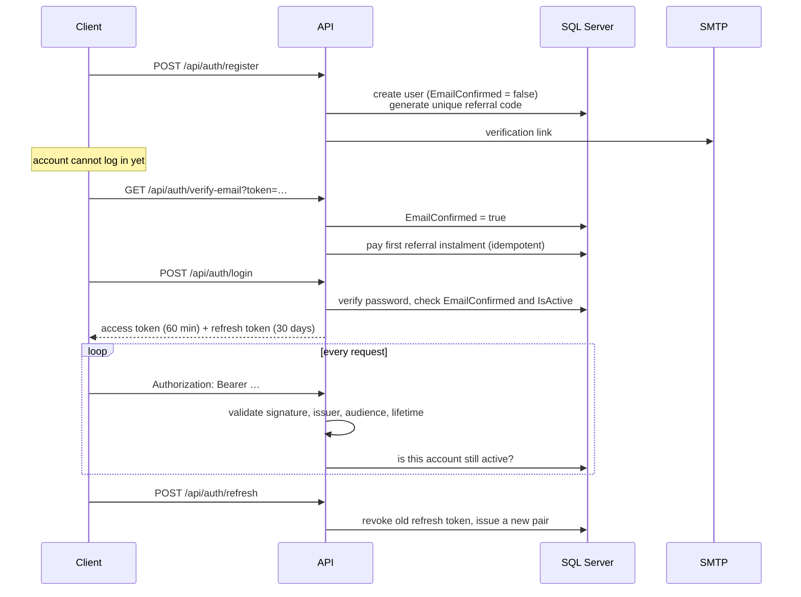

# Security

Authentication, session handling, abuse limits, and how secrets are kept out of the repository.

---

## Authentication flow

### Access token

A JWT signed with HMAC-SHA256, valid for 60 minutes, carrying:

| Claim | Value |
|---|---|
| `nameidentifier` | user id |
| `email` | email address |
| `fullName` | display name |
| `isProvider` | `"true"` / `"false"` |
| `role` | one claim per role — `User`, `Admin` |

Validation is strict: issuer, audience, lifetime and signing key are all checked, and `ClockSkew` is set to `TimeSpan.Zero`. The default five-minute skew would silently extend every token's life by five minutes past its stated expiry.

### Refresh token

Not a JWT — 64 cryptographically random bytes, Base64-encoded, stored as a row. It is a database lookup by design: a JWT could not be revoked, and revocation is the entire point.

Refresh **rotates**: the presented token is marked revoked and a fresh pair is issued. A revoked or expired token is refused. Logout revokes the refresh token, and a password reset revokes every outstanding refresh token for that user in one `ExecuteUpdateAsync` — so changing your password really does sign out every device.

### Why every request re-checks the account

`JwtBearerEvents.OnTokenValidated` performs one primary-key lookup per request to confirm `IsActive`.

Without it, a stateless token stays valid for its full 60 minutes no matter what happens to the account behind it. Deleting your account would not actually stop anything for up to an hour, and an admin ban would not take effect until the attacker's current token expired. The cost is a single indexed lookup that lands in the buffer cache.

---

## Password and account policy

| Setting | Value |
|---|---|
| Minimum length | 8 |
| Requires a digit | yes |
| Requires uppercase | no |
| Requires a symbol | no |
| Unique email | required |
| Confirmed email required to sign in | yes in Production, no in Development |
| Lockout after failed attempts | 8 |
| Lockout duration | 15 minutes |
| Lockout applies to new users | yes |

Length is favoured over character-class requirements, which mostly push people towards `Password1!` and a sticky note.

`RequireConfirmedEmail` is off in Development so that testing does not depend on a working SMTP server; `AuthService.LoginAsync` checks `EmailConfirmed` manually regardless, so the rule holds in both environments and the Identity setting is a second layer rather than the only one.

Account lockout and per-IP rate limiting cover different attacks. Lockout stops many attempts against one account; rate limiting stops many attempts spread across many accounts from one source. Neither alone is sufficient.

## Password reset

A six-digit code, emailed, valid for a short window, **stored as a SHA-256 hash**. If the database leaks, the codes in it are not directly usable.

Identity's built-in `GeneratePasswordResetTokenAsync` was not used: its token is long and unsuited to being typed into a mobile app, and its TOTP provider — which does produce six digits — has a fixed three-minute window, too short if the email sits in a delivery queue. A dedicated table gives control over expiry, attempt count and single use, and `UsedAt` makes reuse impossible.

`POST /api/auth/forgot-password` always reports success, whether or not the address exists. Reporting the difference would turn it into an account-enumeration oracle.

---

## Rate limiting

Before this existed, the auth endpoints were completely unbounded: credential stuffing on `/login`, and email bombing through `/register` and `/resend-verification`.

| Policy | Limit | Endpoints |
|---|---|---|
| `auth` | 5 per 60 s per IP | login, reset-password, delete account |
| `email` | 3 per 900 s per IP | register, resend-verification, forgot-password |

Fixed-window limiters partitioned by remote IP, with `QueueLimit = 0` — over the limit is a 429 with the standard envelope, not a queued wait. The email policy is stricter because those requests cost real money and can be aimed at a third party's inbox.

Both limits live in configuration rather than in code. Production can tune them without a rebuild, and the test suite needs it: in `WebApplicationFactory` every request originates from the same address, so the whole suite would share one quota of five and knock itself over. Tests raise the limits; one dedicated test class lowers them to prove the limiter still works.

---

## Secrets

Nothing secret is committed. `appsettings.json` contains the keys with empty values and a comment explaining the two ways to fill them: `appsettings.Local.json` (gitignored) for development, environment variables for production.

`SecretsGuard.Validate` runs before any service is registered and fails the process with a message naming exactly what is missing. Required everywhere:

- `ConnectionStrings:DefaultConnection`
- `Jwt:Secret` — at least 32 bytes
- `Encryption:MessageKey` — Base64 decoding to exactly 32 bytes
- `AdminSeed:Password`

In Production it additionally requires the SMTP settings, because without them nobody can confirm an account or reset a password.

It also **rejects a hard-coded list of previously-leaked values** — placeholder keys that once appeared in the repository. Those strings can never be used again, in any environment. A key that has been in a public git history is not a key any more, and treating it as one is the failure mode this guards against.

Configuration precedence puts environment variables above `appsettings.Local.json`, which is why `AddEnvironmentVariables()` is called a second time after the local file is added. Otherwise a stale local file on a build agent could override a production secret.

## Encryption at rest

Message bodies are AES-256-CBC encrypted with a random IV per message, stored as `Base64(IV + ciphertext)`. This protects content against direct database access — a stolen backup, a leaked connection string. It is not end-to-end: the server holds the key, because it renders notification previews and enforces retention.

Notification previews (first 60 characters) are stored unencrypted so they can be shown on a lock screen. That is a deliberate, bounded exposure.

---

## Transport and CORS

HTTPS redirection is on. In production the API binds only to `127.0.0.1:8080` and a reverse proxy terminates TLS — the port is not reachable from the internet at all, which also means nothing can bypass the proxy's own limits.

CORS must allow credentials, because the SignalR WebSocket handshake requires it — and that rules out a wildcard origin. The policy resolves in three ways:

| Situation | Allowed origins |
|---|---|
| `Cors:AllowedOrigins` configured | exactly that list |
| Production with nothing configured | `https://localhost` only — deliberately useless |
| Development | any origin, for Swagger and local tooling |

The MAUI client is not a browser and sends no `Origin`, so CORS never applies to it. The policy exists to stop arbitrary websites from making credentialed requests on a signed-in user's behalf.

## Container hardening

The runtime image runs as the non-root `app` user (UID 1654) that the .NET base images provide. Without it, a compromise of the application is root inside the container. That is also why the app listens on 8080 rather than 80 — a non-root process cannot bind a port below 1024.

The image is built from `mcr.microsoft.com/dotnet/aspnet:8.0`, which carries no compiler, SDK or source code; only the publish output crosses over from the build stage.

## Automated scanning

| Tool | Cadence | Scope |
|---|---|---|
| CodeQL | every push and PR to `main`, plus weekly on Monday 06:00 UTC | `security-and-quality` query suite |
| Dependabot | scheduled | NuGet and Docker base images, restricted to minor and patch |
| `-warnaserror` | every CI build | a warning nobody fixes is a warning nobody reads |

Dependabot is limited to minor and patch on purpose: a major-version bump is an architectural decision, not something to merge because a bot opened a PR.

---

## Known limitations

Stated plainly, because a security page that claims completeness is not credible.

- **Message encryption is not end-to-end.** The server can read every message. Making it E2E would break notification previews, retention and moderation.
- **Notification previews are stored in plaintext.** Bounded to the first 60 characters, and required for lock-screen delivery.
- **Refresh tokens are stored in plaintext.** They are high-entropy random values, not passwords, but hashing them would still be an improvement.
- **The active-account check is one database round trip per request.** It belongs in Redis; the code comment marking that intent is already in place.
- **Uploaded files are served straight from `wwwroot/uploads`** with no image re-encoding, so metadata in uploaded photos is preserved as-is.

---

## Related

- [API reference](api-reference.md) — per-endpoint access levels
- [Real-time](realtime.md) — how the same JWT authenticates WebSocket connections
- [Deployment](deployment.md) — secret handling in the deployment pipelines
