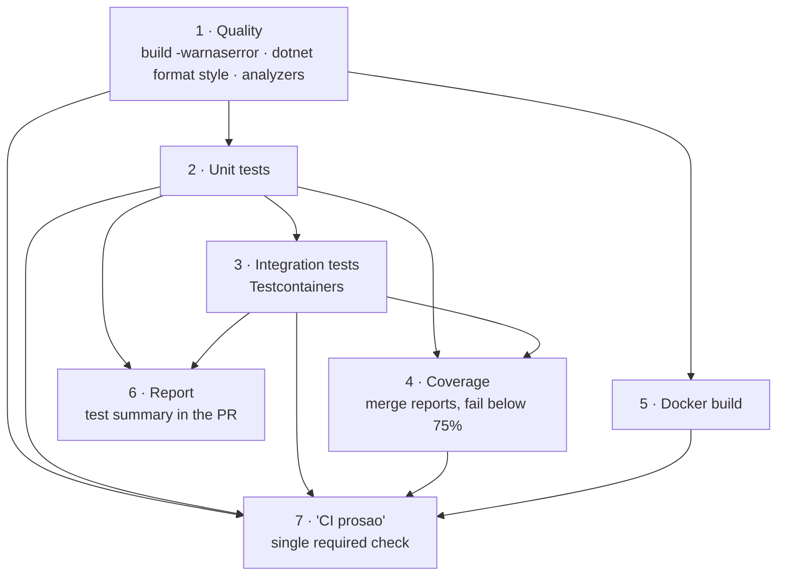

# Testing

207 tests, 82.5% line coverage, enforced as a build gate. Two suites with a deliberate split, and a strategy that departs from the usual pyramid for a reason worth explaining.

> `tests/README.md` is the practical guide — how to run things, what Docker does, the traps. This page covers the strategy and how CI enforces it.

---

## The two suites

```
tests/
├── UsluzionicaServer.UnitTests/          pure functions, no I/O, ~100 ms total
└── UsluzionicaServer.IntegrationTests/
    ├── Infrastructure/                   fixture, factory, builders
    ├── Services/                         service called directly, real database
    └── Api/                              real HTTP through WebApplicationFactory
```

| Suite | Tests | Needs Docker | Runtime |
|---|---|---|---|
| Unit | 58 methods | no | ~100 ms |
| Integration | 87 methods | yes | 10–25 s warm, ~2 min cold |

The unit suite covers what is genuinely a pure unit: `SearchNormalizer`, `Fuzzy`, `MediaUrls`, `SecretsGuard`, `TokenService`, `MessageEncryption`.

## Why business rules are integration tests

The classic pyramid says many unit tests, few integration tests. That does not work here, and the reason is a direct consequence of an architectural choice:

```csharp
public sealed class BookingService(
    AppDbContext db, IConfiguration config,
    NotificationService notificationService, ILogger<BookingService> logger)
```

Services are `sealed`, have no interfaces, and take `AppDbContext` directly. Two consequences follow:

- **NSubstitute cannot substitute them.** A sealed class cannot be inherited.
- **Mocking `DbContext` would be worse than useless.** You would be mocking a LINQ provider, not a database. The test would pass against `List<T>` in memory while production failed on the actual SQL.

So a rule like *"the referral reward is paid on provider activation"* lives in `IntegrationTests/Services/`. That is not a compromise — it is an accurate assessment of where the rule actually exists. The rule is not in a method that can be isolated; it is in the interaction between a service, a transaction, and a unique constraint.

`NSubstitute` is still used where a real interface exists: `IEmailService`, `IHostEnvironment`.

## Why not EF InMemory

|  | InMemory | Real SQL Server |
|---|---|---|
| Unique indexes | **ignored** | enforced |
| `ExecuteUpdateAsync` / `ExecuteDeleteAsync` | **unsupported** | works |
| Transactions and row locks | **none** | real |
| `LIKE`, collation, diacritics | **none** | real |

This is not academic. `TokenConcurrencyTests` proves that eight parallel spends against a balance sufficient for one do not all succeed — which depends entirely on the database holding an exclusive row lock. Against InMemory that test would prove nothing at all. `ExecuteUpdateAsync` is used in twelve places in the codebase, and search depends on `LIKE` and collation behaviour.

InMemory is not a database; it is a dictionary impersonating one. A test that passes against it does not demonstrate that the code works in production.

The integration suite therefore uses **Testcontainers** to start a real SQL Server on a random port, apply all migrations and the 188-category seed, run the tests, and destroy the container. **Respawn** resets data between tests, which is faster than recreating the database — and transaction-per-test does not work here, because services call `SaveChangesAsync` multiple times, partly through `UserManager`.

---

## Three traps, documented because each cost real time

### Identity map — the most common cause of a falsely green test

`DbContext` caches entities it has loaded. Asserting through the **same** context that made the change returns the in-memory instance, not the database row.

```csharp
// WRONG
await bookingService.ConfirmAsync(id, providerId);
var b = await db.BookingRequests.FindAsync(id);   // may come from the cache
b.Status.Should().Be(BookingStatus.Confirmed);    // passes even if nothing was written
```

```csharp
// RIGHT — Query() opens a fresh scope
var b = await Query(db => db.BookingRequests.SingleAsync(x => x.Id == id));
```

`IntegrationTestBase.Query(...)` always opens a new scope, for exactly this reason.

### Environment variables override everything

`Program.cs` calls `AddEnvironmentVariables()` *again* after loading `appsettings.Local.json`, which means `ConfigureAppConfiguration` in `WebApplicationFactory` **cannot** override an environment variable. `DatabaseFixture` therefore sets `ConnectionStrings__DefaultConnection` as an environment variable before the host is constructed at all.

### The rate limiter takes down its own test suite

In `WebApplicationFactory` every request originates from the same (empty) IP, and the limiter partitions by IP — so the entire suite shares one quota of five requests per minute. Solved by moving the limits into configuration: the test host sets them to 100000, and the one class that tests the limiter lowers them again.

---

## Conventions

**Naming.** `Method_Condition_ExpectedOutcome`:

```csharp
[Fact] public async Task Registracija_SaReferralKodom_NeIsplacujeNagraduOdmah()
[Fact] public async Task AktivacijaProvajdera_KadaEmailNijePotvrdjen_Odbija()
```

The name has to say what is being protected without opening the test body. When a test fails in CI, the name is often all you see.

**Every test has a negative counterpart.** A happy-path test proves the code does not crash; it does not prove the rule exists. From `ReferralRewardTests`:

- `AktivacijaProvajdera_KadaJeKorisnikBioPozvan_IsplacujeNagraduPozivaocu` — happy path
- `Registracija_SaReferralKodom_NeIsplacujeNagraduOdmah` — **this is the one that catches a real bug**

The second would fail if someone "simplified" registration by paying the reward immediately — opening a hole where anyone can create accounts with their own referral code and mint tokens for nothing.

**Verifying the tests protect anything.** Break a rule deliberately and run the suite. If **exactly one** test fails, and it is the one guarding that rule, the tests are doing their job. If nothing fails, the test exists but protects nothing.

```bash
dotnet test --filter "FullyQualifiedName~ReferralReward"
```

---

## What is covered

| Area | Tests |
|---|---|
| Search normalization and fuzzy distance | `SearchNormalizerTests`, `FuzzyTests` |
| Message encryption round-trip | `MessageEncryptionTests` |
| Secret validation and leaked-key rejection | `SecretsGuardTests` |
| JWT generation and claims | `TokenServiceTests` |
| Relative/absolute media URL conversion | `MediaUrlsTests` |
| Booking lifecycle and the three-day rule | `BookingRulesTests` |
| Token balance and ledger integrity | `TokenBalanceTests` |
| Concurrent token spending | `TokenConcurrencyTests` |
| Two-instalment referral rewards | `ReferralRewardTests` |
| Provider activation preconditions | `ProviderActivationTests` |
| Discount offer lifecycle | `DiscountOfferTests` |
| Tiered search behaviour | `ListingSearchTests` |
| Search index maintenance via the change tracker | `SearchIndexMaintenanceTests` |
| Full auth flow over HTTP | `AuthFlowTests` |

`AuthFlowTests` is the only suite that goes through real HTTP, exercising the whole pipeline — middleware, rate limiter, JWT validation, controllers.

---

## The CI gate

Seven jobs, ordered so the cheapest failure surfaces first.



**Quality runs first** because it fails in about 30 seconds. Waiting three minutes for the test suite to learn that a space is missing is a waste. `-warnaserror` is used because a warning nobody fixes is a warning nobody reads.

`dotnet format whitespace` is deliberately **not** run. This codebase aligns declarations into columns, which the formatter treats as an error and would collapse to single spaces. There is no `.editorconfig` option to disable it — the .NET formatter has no concept of "align consecutive assignments". `style` and `analyzers` check actual language rules, and both pass.

**Coverage is a gate, not a report.** Previously the Cobertura XML was collected, uploaded, and never read by anyone. The coverage job merges both suites' reports with ReportGenerator — merging matters, because unit tests cover `SearchNormalizer` and integration tests cover the services, and each looks poor in isolation — then parses `line-rate` and fails the build below the threshold.

```
Threshold:  75%
Measured:   82.5% lines, 64.9% branches  (2026-08-26, 207 tests)
```

The threshold is deliberately below the measured value. It is a brake, not a target: it exists to catch a **drop**, not to chase a number. The ~7 point margin absorbs normal variation when code lands slightly ahead of its tests.

`coverlet.runsettings` excludes EF migrations, generated code and `Program.cs`. Without those exclusions the number is inflated — a generated regex was sitting at 91% and dragging the total up on its own.

**Docker build is a separate gate** because `dotnet build` passes with a broken Dockerfile. Everything that only fails inside a container — a missing `curl`, a wrong `COPY`, a lost `wwwroot` — otherwise surfaces at deploy time, which is the worst possible moment. The image is built but not published; publishing is CD's job.

**One required check.** GitHub branch protection requires check names to be listed by hand, so listing each job individually would mean every new job also needs a settings change — easily forgotten, at which point the gate silently stops applying. Instead `CI prosao` depends on all of them and fails if any failed, and it is the only name in the ruleset. Its name has no diacritics on purpose: it is typed by hand into branch protection and compared literally, and `CI prošao` versus `CI prosao` produces a rule that waits forever for a check that never appears, with nothing anywhere explaining why.

---

## Related

- [tests/README.md](https://github.com/djuk1ca/UsluzionicaServer/blob/main/tests/README.md) — how to run everything, and what Docker is doing
- [Token economy](token-economy.md) — the concurrency bug the tests found
- [Deployment](deployment.md) — what happens after CI goes green
