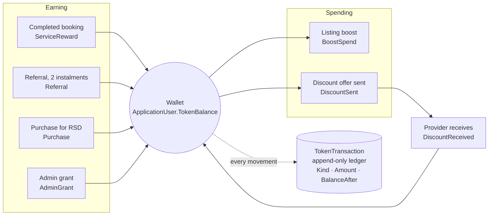
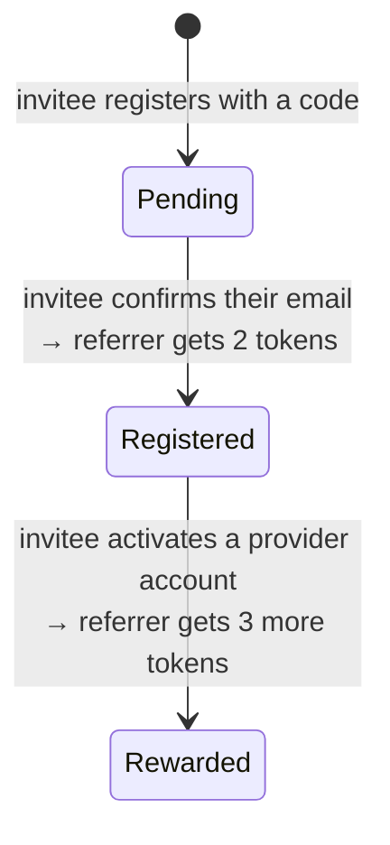
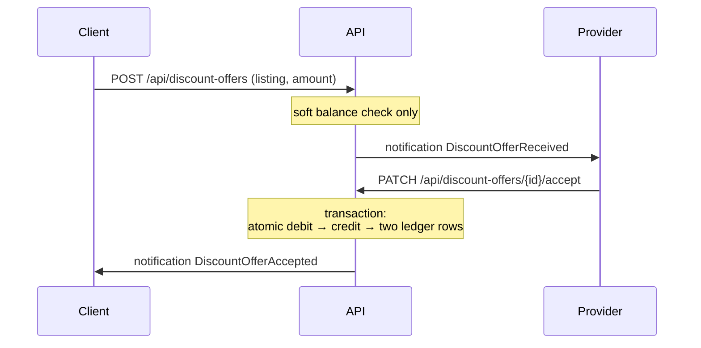

# Token economy

Tokens are the platform's internal currency. Clients earn them by actually using the service and spend them to negotiate discounts; providers accept them as part-payment and spend them on visibility.

The interesting part is not the accounting — it is that every earning path is designed so that faking it costs more than the reward is worth.

---

## Flow



`ApplicationUser.TokenBalance` is the live balance; `TokenTransaction` is the append-only ledger behind it. Every movement writes both, and every ledger row records `BalanceAfter` so any single line in a user's history can be explained without replaying the whole ledger.

---

## Earning

### Completed service — `ServiceReward`

When a provider marks a confirmed booking as executed, the **client** receives `Booking:ServiceRewardTokens` (configured at 1 token). Three rules protect it:

1. **Status gate.** Only a `Confirmed` booking can be executed.
2. **Three-day rule.** Execution is refused until `Booking:ExecuteAfterDays` (3) days have passed since `AcceptedAt`. Without it, a provider and an accomplice could create, confirm and complete a booking within a minute and mint tokens on repeat.
3. **Single execution.** `ServiceExecution.BookingRequestId` is unique, and the service returns early if a `ServiceExecution` already exists — so the endpoint is idempotent and a booking pays out exactly once.

The error message counts down, telling the provider how many days remain rather than failing opaquely.

### Referral — two instalments

A referral pays in two parts, and neither is triggered by an action that is free to repeat.



| Trigger | Status | Reward | Config key |
|---|---|---|---|
| Invitee confirms their email address | `Registered` | 2 tokens | `Referral:SignupRewardTokens` |
| Invitee activates a provider account | `Rewarded` | 3 tokens | `Referral:ProviderActivationRewardTokens` |

**Why the first instalment waits for email confirmation rather than registration.** Registration is free and unlimited, so paying on registration would mean anyone can open accounts with their own code and harvest tokens. Confirming an email requires a real, unique, working address per account. On top of that, an account with an unconfirmed email cannot even log in — so in this system it is not yet an account at all.

Both payout methods are **idempotent and safe under concurrent calls**, which is not a theoretical concern: verification links get activated twice routinely (a mail client prefetches the URL, then the user clicks it), and password reset is a second path through which an email can become confirmed.

The instalments are tracked as two nullable columns — `SignupTokensAwarded` and `ActivationTokensAwarded` — rather than a single amount. Nullable rather than zero, deliberately: it distinguishes *not paid* from *paid zero*.

`Referral.ReferredUserId` is unique, so a user can be referred exactly once in their lifetime, regardless of how many codes they try.

### Purchase and admin grant

`TokenPurchase` records a purchase for RSD with optional bonus tokens and a `Pending` / `Completed` / `Failed` status. `AdminGrant` covers manual credits from the admin panel, which appear in the ledger like any other movement and are visible in the admin token log.

---

## Spending

### Boost — buying visibility

A provider spends tokens to raise a listing in search results.

```
BoostScore delta = tokensToSpend / durationDays
```

| Spend | Duration | Delta |
|---|---|---|
| 3 tokens | 3 days | +1.0 |
| 7 tokens | 7 days | +1.0 |
| 6 tokens | 3 days | +2.0 |

The formula means the score buys *intensity*, not *duration* — spreading the same tokens over a longer period ranks you lower for longer, and concentrating them ranks you higher for a shorter time. Durations are restricted to 3, 7 or 14 days.

`BoostScore` is additive, so overlapping boosts stack. `BoostExpiryService` runs hourly, subtracts each expired boost's contribution, and when a listing has no active boosts left resets `IsBoosted`, `BoostScore` and `BoostExpiresAt` — the reset also clears accumulated floating-point residue.

Ordering in the default listing view is `IsBoosted` → `BoostScore` → `CreatedAt`, and there is a composite index covering exactly that.

### Discount offers — negotiating with tokens

A client offers tokens to a provider in exchange for a lower price on a specific listing, usually from inside a conversation.



The balance check at creation time is intentionally soft — a courtesy so the client is not allowed to send an offer they obviously cannot cover. The **binding** check happens on accept, inside a transaction, because the balance can change between the two moments.

An accepted offer writes two ledger rows: `DiscountSent` (negative, sender) and `DiscountReceived` (positive, receiver).

---

## Concurrency: the part that was actually broken

Both spending paths originally read the balance, compared it in memory, and then subtracted:

```csharp
var user = await db.Users.FindAsync(userId);
if (user.TokenBalance < amount) return Error();
user.TokenBalance -= amount;
await db.SaveChangesAsync();
```

Between the read and the write there is a window in which another request reads the same balance. Both pass the check, both subtract, and the balance goes negative.

This was not hypothetical. `TokenConcurrencyTests` fires eight parallel boost requests against a balance sufficient for exactly one — **all eight succeeded.**

The fix is to make the check and the subtraction a single SQL statement:

```csharp
var affected = await db.Users
    .Where(u => u.Id == userId && u.TokenBalance >= amount)
    .ExecuteUpdateAsync(s => s.SetProperty(
        u => u.TokenBalance,
        u => u.TokenBalance - amount));

if (affected == 0) { /* insufficient funds */ }
```

Which produces:

```sql
UPDATE AspNetUsers
   SET TokenBalance = TokenBalance - @amount
 WHERE Id = @id AND TokenBalance >= @amount
```

The database holds an exclusive lock on the row, so the second request waits and then re-evaluates the condition against the already-reduced balance. Zero affected rows means insufficient funds.

Two consequences follow, and both are handled explicitly in the code:

- **The whole operation is wrapped in a transaction.** A crash between debiting tokens and inserting the `ListingBoost` row would otherwise leave the user with neither tokens nor boost.
- **`ExecuteUpdateAsync` bypasses the change tracker,** so any tracked user instance is now stale. The balance is re-read from the database before writing the ledger row, so `BalanceAfter` is accurate.

This is also the reason the test suite runs against a real SQL Server rather than EF InMemory — a provider that does not implement row locks would let the broken version pass. See [ADR-0004](adr/0004-atomic-token-deduction.md).

---

## Configuration

| Key | Default | Meaning |
|---|---|---|
| `Booking:ServiceRewardTokens` | 1 | tokens the client earns per completed service |
| `Booking:ExecuteAfterDays` | 3 | days after acceptance before execution is allowed |
| `Referral:SignupRewardTokens` | 2 | first referral instalment |
| `Referral:ProviderActivationRewardTokens` | 3 | second referral instalment |

All four are configuration rather than constants, so the economy can be tuned in production without a rebuild — and so tests can set them to values that make a rule easy to prove.

---

## Related

- [Domain model](domain-model.md) — the ledger and boost entities
- [Testing](testing.md) — how the concurrency and referral rules are verified
- [API reference](api-reference.md) — the wallet, boost and offer endpoints
